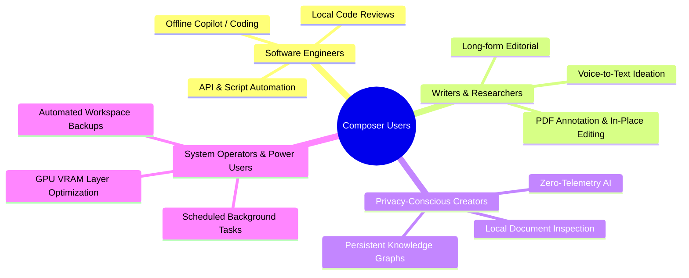
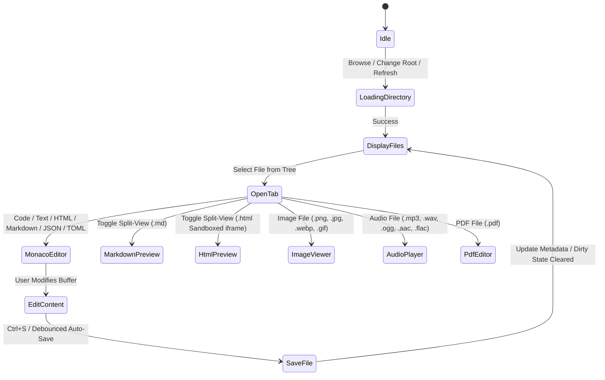
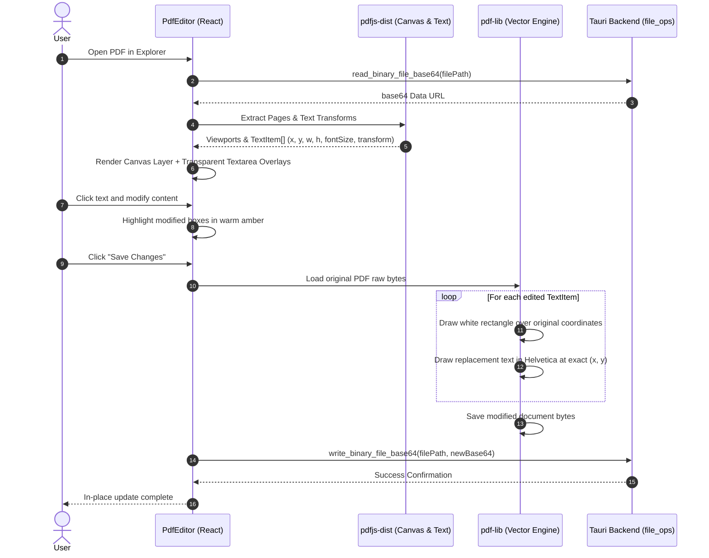
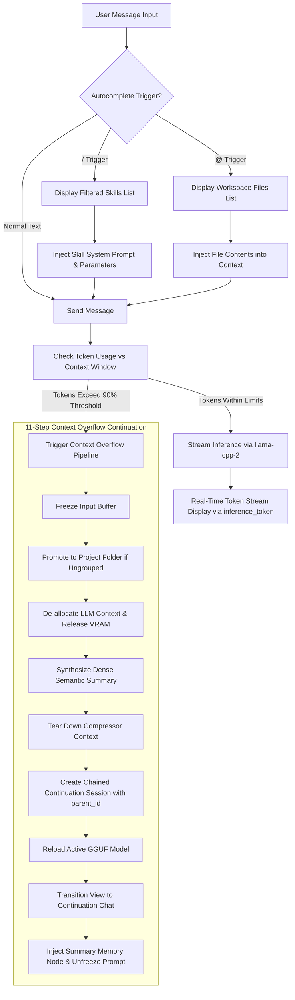
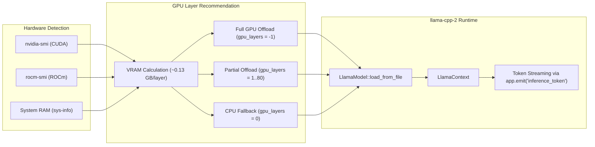
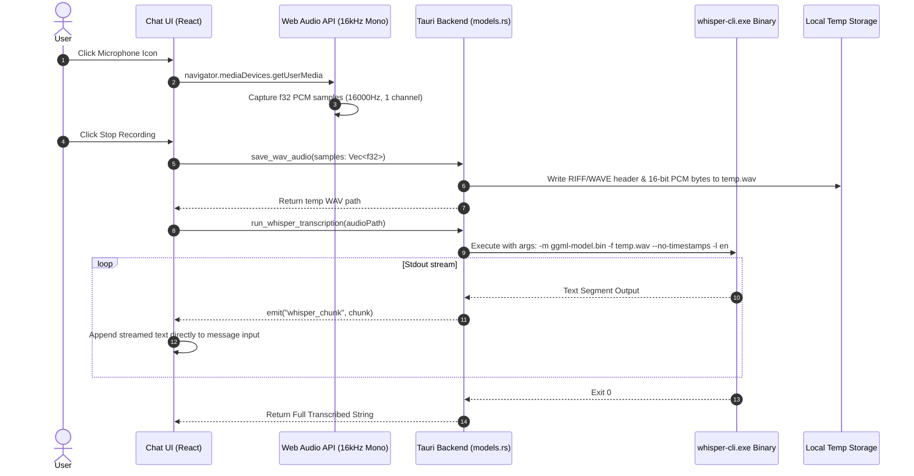
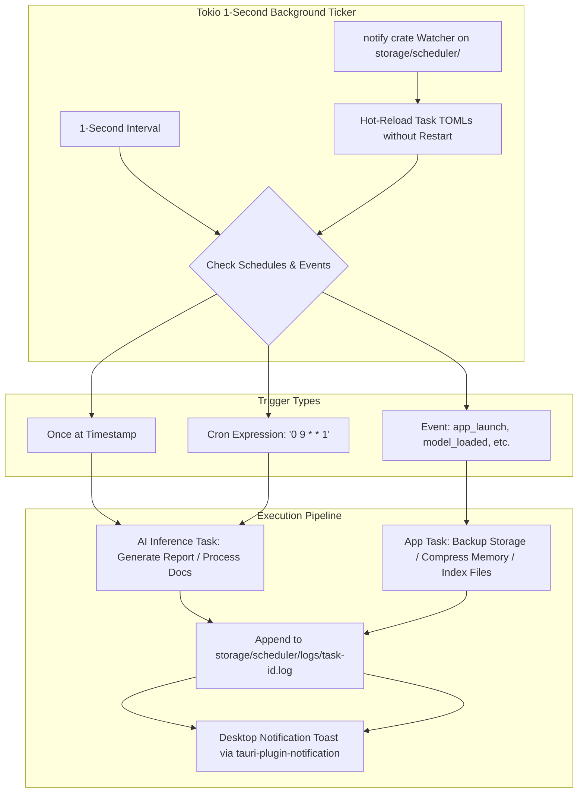
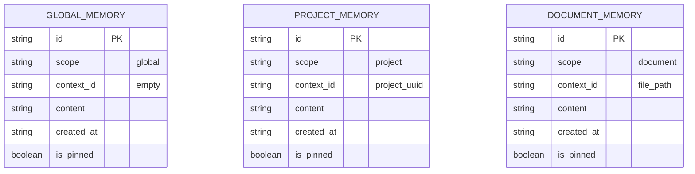
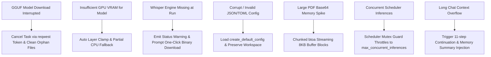
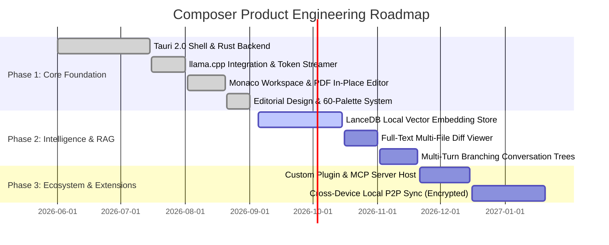

# Product Requirements Document (PRD): Composer Desktop

**Document Version:** 1.1.0  
**Product Name:** Composer  
**Product Category:** Local-First AI Creator & Developer Studio  
**Target Platform:** Desktop (Windows, macOS, Linux)  
**Tech Stack:** Tauri 2.0 + Rust + React 19 + TypeScript + Vite + Tailwind CSS v4 + Monaco Editor + llama.cpp (`llama-cpp-2`) + Whisper.cpp  

---

## 1. Executive Summary & Product Vision

### 1.1 Vision Statement
**Composer** is an offline-first, local-native desktop AI workspace and creator studio that unifies local LLM inference, voice dictation, multi-format file management, interactive in-place PDF editing, persistent long-term memory, and background task automation—encapsulated within a highly customizable editorial design system.

### 1.2 Core Value Propositions
* **100% Local & Private:** Zero cloud dependency for core features; all LLM inference (`llama.cpp` via `llama-cpp-2`), speech-to-text transcription (`whisper.cpp`), document indexing, and memory persistence occur strictly on the user’s local machine with zero telemetry.
* **Integrated Document & Code Studio:** Seamless editing of code, Markdown, plain text, images, and visual PDFs with in-place text replacement in a single unified workspace.
* **Context-Aware Conversational Intelligence:** Autonomous context overflow continuation, `@` workspace file tagging, `/` skill prompt templates, persistent multi-scope memory injection, and real-time token streaming.
* **Proactive Automation Engine:** A multi-threaded Tokio cron and event-driven scheduler that hot-reloads tasks from disk via `notify` watchers, executing periodic AI generations, automated backups, and memory compression in the background.
* **Bespoke Editorial Aesthetics:** A warm editorial typography engine paired with high-contrast dark themes, 60+ curated palettes, dynamic accent glows, edge smoothness controls, and 6 distinct layout navigation structures.

---

## 2. User Personas & Problem Space



### 2.1 Target Personas
1. **The Privacy-Conscious Developer:** Demands zero data exfiltration, runs quantized open-weight models (Llama 3, DeepSeek R1, Qwen 2.5 Coder) on local GPU VRAM, and requires an integrated Monaco code editor with split previews.
2. **The Researcher & Editorial Writer:** Requires distraction-free typography (EB Garamond, Playfair Display), quick audio transcription for brainstorming, split-view Markdown preview, and seamless PDF modification without layout drift.
3. **The Knowledge Worker & Power User:** Manages dense multi-session projects, requires persistent memory across chat sessions, and relies on automated background workflows (e.g., daily summaries, automatic document backups).

### 2.2 Key Problems Solved
* **Privacy & Subscription Fatigue:** Eliminates cloud API costs and privacy risks by running inference on local hardware.
* **Fragmented Tooling:** Replaces separate apps for text editing, PDF editing, local LLM wrappers (Ollama/LM Studio), voice transcription, and cron scheduling with a single cohesive binary.
* **Context Window Degradation:** Solves LLM context overflow through an automated 11-step continuation pipeline that compresses prior sessions into high-density memory nodes.

---

## 3. System Architecture & High-Level Design

### 3.1 Architecture Overview
Composer is built as a hybrid desktop application utilizing **Tauri v2** with a high-performance **Rust** core and a modern **React 19 / TypeScript** presentation layer.

```mermaid
graph TB
    subgraph Frontend ["Frontend Presentation Layer (React 19 + TypeScript + Vite)"]
        UI[App Shell, Navigation & Titlebar]
        EXP[Explorer & Monaco Workspace Studio]
        PDF[In-Place PDF Canvas & Vector Editor]
        CHAT[Chat Studio, Token Streamer & Voice Recorder]
        SKILLS[Skills Manager & TOML Editor]
        SCHED[Scheduler Dashboard & Live Logs Console]
        SET[System Settings, Theme Engine & Model Hub]
        CTX[Universal Context Menu Provider]
    end

    subgraph IPC ["Tauri 2.0 IPC Bridge"]
        INVOKE[Tauri Command Invocation (44 Native Commands)]
        EVENTS[Event Bus (inference_token, whisper_chunk, download_progress, config_updated)]
    end

    subgraph Backend ["Native Backend Core (Rust / Tokio / Tauri Core)"]
        LIB[lib.rs Tauri IPC Router]
        CONF[config.rs Configuration & Path Resolver]
        FOPS[file_ops.rs Filesystem Walker & Binary I/O]
        MODELS[models.rs llama-cpp-2 Inference, GPU Detection & Whisper CLI]
        MEM[memory.rs Hierarchical Memory Store & Compression]
        TASK[scheduler.rs Tokio Background Daemon & Notify Watcher]
    end

    subgraph Storage ["Local Storage Root Directory (/storage)"]
        DOCS[workspace/ User Code & Documents]
        CONV[conversations/ Standalone Chats & Project Trees]
        GGUF_MODELS[models/*.gguf Weights]
        WHISPER_STORE[whisper/ whisper-cli.exe & ggml-*.bin]
        MEM_STORE[memory/memory_store.json & archive/]
        SKILL_STORE[skills/*.skill.toml]
        TASK_STORE[scheduler/*.task.toml & logs/*.log]
        THEMES_STORE[users/*.json Custom Theme Presets]
        ASSETS_STORE[assets/user_avatar.* User Custom Logo]
        CFG_STORE[config.json Master Configuration]
        BACKUP_STORE[storage_backup/ Automated Snapshots]
    end

    UI --> INVOKE
    EXP --> INVOKE
    PDF --> INVOKE
    CHAT --> INVOKE
    SKILLS --> INVOKE
    SCHED --> INVOKE
    SET --> INVOKE

    EVENTS --> UI
    EVENTS --> CHAT
    EVENTS --> SET

    INVOKE --> LIB
    LIB --> CONF
    LIB --> FOPS
    LIB --> MODELS
    LIB --> MEM
    LIB --> TASK

    CONF --> CFG_STORE
    FOPS --> DOCS
    FOPS --> CONV
    FOPS --> ASSETS_STORE
    FOPS --> THEMES_STORE
    MODELS --> GGUF_MODELS
    MODELS --> WHISPER_STORE
    MEM --> MEM_STORE
    FOPS --> SKILL_STORE
    TASK --> TASK_STORE
    TASK --> BACKUP_STORE
```

### 3.2 Technology Stack

| Layer | Technology | Purpose / Role |
| :--- | :--- | :--- |
| **Desktop Shell** | Tauri v2.0 | Native window lifecycle, OS menus, hardware bridges, secure IPC |
| **Backend Core** | Rust (2021 Edition) | High-speed I/O, background threading, GPU detection, hardware management |
| **Async Runtime** | Tokio (v1) | Multi-threaded asynchronous tasks, ticker loops, HTTP downloads |
| **LLM Inference** | `llama-cpp-2` (v0.1) | Direct C++ binding for GGUF model execution, GPU layer offloading, token sampling |
| **Speech-to-Text** | `whisper.cpp` CLI binary | Local audio speech recognition and real-time text transcription |
| **UI Framework** | React 19 + TypeScript 5.8 | Declarative component state, responsive UI rendering |
| **Code & Text Editor** | `@monaco-editor/react` (v4.7) | VS Code-grade code editor, syntax highlighting, search/replace, diffs |
| **PDF Rendering** | `pdfjs-dist` (v6.0) | PDF canvas rendering, viewport transform, text content coordinate extraction |
| **PDF Manipulation** | `pdf-lib` (v1.17) | User-space text deletion/white-out and vector font redraw |
| **Styling & Theme** | Tailwind CSS v4 + CSS Variables | Dynamic editorial theme tokens, glassmorphism, responsive navigation layouts |
| **Icons & Motion** | `lucide-react` | Iconography and UI controls |
| **System Plugins** | `tauri-plugin-dialog`, `tauri-plugin-fs`, `tauri-plugin-notification`, `tauri-plugin-opener` | Native system dialogs, file system security, push notifications, and default browser links |

---

## 4. Comprehensive Feature & Functional Specifications

---

### 4.1 Module 1: File Explorer & Monaco Workspace Studio



#### 4.1.1 Capabilities & Functional Rules
1. **Directory Tree & File Walker:**
   * Resizable sidebar width (160px to 600px) with interactive column drag-handle.
   * Collapsible directory trees, file searching by name, and alphabetical sorting with directories prioritized.
   * Fast recursive workspace indexer excluding heavy directories (`node_modules`, `target`, `.git`, `dist`, `build`, `models`, `whisper`).
2. **Multi-Tab Document Workspace:**
   * Support for simultaneously opened tabs with dirty state indicators (`•`), tab close shortcuts, and unsaved changes tracking.
   * Dynamic file type classification: `code`, `markdown`, `html`, `json`, `toml`, `pdf`, `image`, `audio`.
3. **Monaco Editor Integration:**
   * Dynamic theme switching (`vs-dark` vs. `vs-light`) automatically calculated from active theme lightness (`--theme-ink`).
   * Language auto-detection based on file extension (TypeScript, JavaScript, Rust, Python, HTML, Markdown, JSON, TOML/INI).
   * Word wrap enabled, compact scrollbars, and customized typography.
4. **Interactive Markdown & HTML Split-View:**
   * Side-by-side editing with live rendered Markdown preview supporting drop-cap editorial styling.
   * Sandboxed HTML `<iframe>` preview with live reload and inspection controls.
5. **Interactive Asset Viewers:**
   * **Image Inspector:** Base64 preview of PNG, JPEG, GIF, and WebP images displaying intrinsic dimensions (width × height), formatted file size, and file path.
   * **Audio Player & Waveform Visualizer:** In-app audio player supporting `.mp3`, `.wav`, `.ogg`, `.aac`, `.flac` with Web Audio API canvas waveform visualizer and playback controls.
6. **File Operations & Custom Modals:**
   * Native creation of new files and folders within current active directory.
   * Native OS file/folder picker imports (`pick_file`, `pick_directory` via `import_to_directory`).
   * Inline renaming modal with error validation.
   * File deletion with recursive directory removal (`delete_file_or_dir`).
   * Reveal in native OS file manager (`open_in_file_manager`).
   * Multi-version snapshot history tracking per file with one-click restore.
7. **Docked AI Assistant Sidebar:**
   * Collapsible AI Copilot panel docked directly beside the active Monaco editor buffer, allowing inline prompts, code reviews, and explanations.

---

### 4.2 Module 2: In-Place Visual PDF Editor Engine

#### 4.2.1 Architecture & Workflow
The PDF Editor transforms static PDF documents into interactive, editable canvases by combining `pdfjs-dist` (for rendering and coordinate extraction) with `pdf-lib` (for binary modification).



#### 4.2.2 Key Features
* **Zero Layout Shift:** Uses user-space matrix transforms `[a, b, c, d, e, f]` to calculate exact bounding boxes matching original text placements.
* **Non-Destructive Overlays:** Edit fields remain invisible until focused, blending seamlessly with the rendered canvas.
* **Dirty Text Tracking:** Edited blocks are highlighted in warm amber (`rgba(255,220,80,0.40)`) with clear visual boundaries.
* **Chunked Base64 Output:** Uses memory-safe chunked base64 encoding (8KB chunks) to bypass browser call stack limitations on large PDF documents.

---

### 4.3 Module 3: Conversational AI Studio & Context Management



#### 4.3.1 Conversational Structure
* **Project Folders vs. Ungrouped Chats:**
  * Conversations are organized either as standalone files (`storage/conversations/<id>.json`) or nested inside structured Project directories (`storage/conversations/projects/<project_id>/`).
  * Projects include custom color badges, dedicated skills, and metadata stored in `project.toml`.
  * Inline renaming for both chats and projects directly in the sidebar.
* **Automatic Project Promotion:**
  * When an ungrouped conversation exceeds the configured message threshold (default: 20 messages), it is automatically promoted to a named Project folder using automated naming inference.
* **Autocomplete Mentions:**
  * `/` Trigger: Autocompletes installed AI Skills, automatically applying the skill's system instructions, temperature, and token parameters.
  * `@` Trigger: Autocompletes workspace files, pulling their raw contents directly into the prompt context.
* **Live Token Streaming:**
  * Subscribes to Tauri event `inference_token`, rendering tokens as they are emitted from the native inference loop.
* **Context Overflow Continuation Pipeline:**
  * Protects against context limit truncation with an automated 11-step visual transition:
    1. Context limit boundary warning.
    2. Notification toast trigger.
    3. Input buffer freeze.
    4. Project folder verification/promotion.
    5. Context de-allocation and VRAM clearance.
    6. LLM semantic summary synthesis.
    7. Summary compressor teardown.
    8. Creation of new continuation session.
    9. GGUF model reloading.
    10. View transition to new session.
    11. Prompt unfreeze with compressed summary injected.
* **Context Drawer:**
  * Inspects current token usage, active skill, loaded model, and pinned/relevant memory nodes (`query_memories`).
* **Custom User Chat Avatar:**
  * Displays a personalized avatar image loaded via `convertFileSrc` from `storage/assets/user_avatar.<ext>`, replacing the default "U" icon. Supports image upload and removal.

---

### 4.4 Module 4: Local Model Hub & GPU Acceleration Subsystem



#### 4.4.1 HuggingFace GGUF Model Hub
* **Curated Model Registry:** Built-in catalog across 7 model families:
  * **Llama 3 / 3.1:** Meta-Llama-3-8B-Instruct (Q4_K_M), Meta-Llama-3.1-70B-Instruct (Q3_K_M).
  * **Gemma 3:** Gemma-3-4B-IT, Gemma-3-12B-IT, Gemma-3-27B-IT.
  * **Mistral / NeMo:** Mistral-7B-Instruct-v0.3, Mistral-Nemo-Instruct-2407.
  * **Phi 4:** Phi-3-mini-128k, Phi-4-Q4_K_M.
  * **DeepSeek R1:** DeepSeek-R1-Distill-Qwen-7B, DeepSeek-R1-Distill-Llama-70B.
  * **Qwen 2.5:** Qwen2.5-7B-Instruct, Qwen2.5-Coder-14B-Instruct.
  * **Falcon 3:** Falcon3-7B-Instruct.
* **Gated Model Access:**
  * Secure local storage of Hugging Face access tokens (`hf_token`) required for gated models like Gemma 3.
* **Resilient Download Manager:**
  * Direct downloads via `reqwest` streaming with redirect handling for HuggingFace CDN tokens.
  * Real-time progress broadcasting (`download_progress` events throttled to 4/sec) and instant cancellation support (`cancel_model_download`).

#### 4.4.2 Hardware Acceleration & GPU Offloading
* **Multi-Backend GPU Detection:**
  * NVIDIA CUDA: Subprocess execution of `nvidia-smi` to parse GPU index, name, total VRAM, free VRAM, and CUDA compute capability.
  * AMD ROCm: JSON output parsing of `rocm-smi` to extract memory total and usage metrics.
* **Intelligent Layer Allocation:**
  * Dynamically computes layer offloading based on free VRAM: returns `-1` (full GPU offload) if total size fits; otherwise calculates partial layer offload (~0.13 GB per layer up to 80 layers) or falls back to CPU (`0` layers).
  * Backend selector: `cpu`, `cuda`, `rocm`, `metal`, `vulkan`.
* **Live System Metrics:**
  * Background polling of physical CPU RAM usage via `sys-info` rendered in the sidebar status bar.

---

### 4.5 Module 5: Whisper STT Voice Engine & Audio Pipeline



#### 4.5.1 Functional Rules
1. **Engine Auto-Provisioning:** Automatic download and extraction of precompiled `whisper-cli.exe` binaries from official GitHub releases (`ggerganov/whisper.cpp`) into `storage/whisper/` via `download_whisper_binary`.
2. **Model Selection & VRAM Check:** Support for multiple model tiers: `tiny` (75 MB), `base` (145 MB), `small` (460 MB), `medium` (1.5 GB), `large-v3` (2.9 GB). Automatic VRAM verification via `check_vram_available` to suggest GPU vs CPU execution mode.
3. **Lossless Pure-Rust WAV Formatting:** Audio captured via Web Audio API at 16kHz mono is formatted directly into a standard 16-bit PCM RIFF WAV container without external encoding dependencies.
4. **Streaming Chunk Feedback:** Transcription output is streamed line-by-line via `whisper_chunk` events, giving instant visual feedback in the message textarea.

---

### 4.6 Module 6: AI Skills & Behavioral Prompt Framework

#### 4.6.1 Skill Specification & TOML Schema
Skills define specialized personas, guardrails, sampling parameters, and triggering conditions. They are persisted as individual `.skill.toml` files in `storage/skills/`.

```toml
[skill]
name = "Code Reviewer"
description = "Reviews code for bugs, performance, and style"
version = "1.0.0"
author = "system"
enabled = true

[scope]
type = "file_type" # "global" | "file_type" | "task_type"
file_types = ["rs", "ts", "py", "js"]

[behavior]
system_prompt = """
You are a senior code reviewer. When reviewing code: identify bugs, performance problems, style leaks, and suggest optimal fixes.
"""
temperature = 0.3
max_tokens = 2048
response_format = "markdown"

[memory]
use_long_term = true
inject_relevant_memories = true

[triggers]
auto_activate_on_file_open = true
auto_activate_on_chat_start = false
```

#### 4.6.2 Key Features
* **Dual Editing Modes:** Visual form editor for rapid tuning and Monaco TOML editor with real-time bidirectional synchronization.
* **System Skill Protection:** Built-in system skills are protected from accidental edits with a one-click "Duplicate to Custom" feature.
* **Context Injection:** Automatic injection of long-term memory nodes and skill-specific behavior into chat sessions and scheduled tasks.

---

### 4.7 Module 7: Automation & Background Scheduler Engine



#### 4.7.1 Scheduling Capabilities
* **Flexible Frequencies:**
  * `once`: Executes at a specific ISO timestamp and marks the task as completed.
  * `recurring`: Standard 5-field cron parsing using the `cron` crate (e.g., `0 9 * * 1` for every Monday at 9:00 AM).
  * `on_event`: Event-driven execution triggered by lifecycle events (`app_launch`, `model_loaded`, `file_created`, `chat_context_full`, `project_created`).
* **Variable Template Expansion:** Output file paths support dynamic template tokens: `{date}` (YYYY-MM-DD), `{time}` (HH-MM), and `{user_storage_root}`.
* **System Operations:** Pre-built native operations including automated config backup (`storage_backup/`), memory store compression, and workspace document re-indexing.
* **Live Logging & Inspection:** Real-time log streaming to dedicated log files (`storage/scheduler/logs/<id>.log`) accessible directly in the UI console drawer.

---

### 4.8 Module 8: Hierarchical Memory & Semantic RAG System

#### 4.8.1 Multi-Scope Memory Structure
Memory nodes are stored in `storage/memory/memory_store.json` across three distinct scopes:



#### 4.8.2 Memory Compression Pipeline
* **Trigger Condition:** Executes when 3 or more unpinned memory nodes exist in a given scope.
* **Archival:** Moves raw, detailed memory nodes into a timestamped JSON file in `storage/memory/archive/`.
* **Synthesis:** Replaces raw memories with a unified summary node marked with `[COMPRESSED MEMORY PREFERENCES]`, automatically setting `is_pinned = true` to preserve context.

---

### 4.9 Module 9: Design System, Aesthetic Customization & Multi-Layouts

#### 4.9.1 Design System Tokens & Palette Engine
Colors update dynamically in `document.documentElement.style` with zero page reload.

| Token | Light Default | Dark Default | Description |
| :--- | :--- | :--- | :--- |
| `--theme-paper` | `#f6f2ea` | `#181410` | Primary application canvas background |
| `--theme-ink` | `#18140f` | `#ffffff` | Primary text and high-contrast foreground elements |
| `--theme-cream` | `#ede8dc` | `#221e1a` | Secondary surfaces, sidebars, card backgrounds |
| `--theme-rule` | `#c9bfab` | `#3c352a` | Structural borders, dividers, frame outlines |
| `--theme-accent` | `#b8440c` | `#b8440c` | Brand accent color, primary buttons, indicators |
| `--theme-muted` | `#8a7f6e` | `#a0988a` | Subtitle text, metadata, secondary icons |

#### 4.9.2 Theme Presets & Randomizer
* **Built-In Presets:**
  * **Default Light:** Warm editorial linen paper `#f6f2ea`, deep charcoal ink `#18140f`, terracotta accent `#b8440c`.
  * **Default Dark:** Rich night ink `#181410`, pure paper text `#ffffff`, muted card `#221e1a`.
  * **Red Night:** Deep maroon-black `#1a0d0d`, electric crimson `#ff3d3d`.
  * **Matrix Shit:** Terminal deep green `#0a1a10`, cyber phosphor `#00ff88`.
* **Custom Saved Themes:** Saved as JSON in `storage/users/<name>.json`, with live gradient preview buttons.
* **60 Curated Editorial Palettes:** Built-in randomized palettes with rolling 3D dice button for instant visual discovery.

#### 4.9.3 Visual Controls & Atmospheric Detail
* **Dynamic Accent Glow:** Toggleable neon atmospheric glow with brightness slider (20% to 250%).
* **Edge Smoothness Controls:** Sliders for overall UI edge smoothness (0px to 24px) and Navbar edge smoothness.
* **Typography Presets:** 8 distinct profiles:
  1. *Editorial Neo-Classical:* EB Garamond (Body) + Playfair Display (Headings) + Inter (Metadata).
  2. *Crisp Modern Sans:* Unified Inter for a sleek technical interface.
  3. *Cyber Terminal Mono:* JetBrains Mono for a developer-centric aesthetic.
  4. *Warm Press Retro:* Georgia + Courier New for a vintage press feel.
  5. *High-Tech Grotesk:* Space Grotesk + JetBrains Mono.
  6. *Humanist Soft:* Plus Jakarta Sans + Outfit.
  7. *Swiss Minimalist:* Helvetica / Arial + Inter.
  8. *Technical Code:* Fira Code + Inter.

#### 4.9.4 Multi-Layout Navigation Engine
Composer supports 6 distinct navigation layouts configurable in real-time:
1. **Left Fixed Sidebar (Default):** Classic 224px sidebar with brand header, welcome banner, page list, and live VRAM/RAM hardware meter.
2. **Right Fixed Sidebar:** Mirrored right-hand layout optimized for RTL or secondary monitor placement.
3. **Left Vertical Pills:** Ultra-compact 64px icon bar with glowing monogram indicator and minimal screen footprint.
4. **Right Vertical Pills:** Mirrored compact vertical pill bar.
5. **Top Navbar:** Horizontal 48px header bar with integrated navigation pills and status badges. Supports Icon Only vs. Icon + Text mode.
6. **Bottom Navbar:** Horizontal 48px footer bar. Supports Icon Only vs. Icon + Text mode.

---

## 5. Non-Functional Requirements

### 5.1 Performance & Resource Targets
* **Cold Startup Time:** `< 800ms` to interactive UI (loading splash screen gracefully unmounts upon initialization).
* **Inference Latency:** Zero UI freeze during inference; token generation streams at `>= 25 tokens/sec` on GPU (CUDA/ROCm) and `>= 8 tokens/sec` on CPU for 7B-class models.
* **Memory Footprint:** Native Tauri frontend idle RAM `< 90 MB`; background Rust core `< 45 MB` (excluding loaded GGUF model buffer).
* **UI Responsiveness:** 60 FPS slider interactions for color adjustments, theme switching, and live layout transitions.

### 5.2 Privacy & Security
* **Zero Telemetry:** No outbound network requests for tracking, analytics, or user logging.
* **Local Sandboxing:** All model weights, audio recordings, chat logs, and configurations remain strictly within the user-specified root directory.
* **Secure Token Storage:** HuggingFace API tokens are stored locally in plaintext `config.json` inside the user's storage directory without cloud synchronization.

### 5.3 Reliability & Fault Tolerance
* **GGUF Load Protection:** Graceful fallback to CPU if GPU VRAM allocation fails or is insufficient.
* **Hot-Reloading File Watchers:** Config, scheduler tasks, and skills reload dynamically via `notify` without requiring an application restart.
* **Safe Binary Overwrite:** Binary operations write through temporary buffers, preventing document corruption on interrupted writes.

---

## 6. Complete Data Models & Storage Schemas

### 6.1 Application Configuration (`config.json`)

```json
{
  "general": {
    "app_name": "Composer",
    "language": "en",
    "date_format": "YYYY-MM-DD",
    "launch_page": "Explorer",
    "auto_update": false
  },
  "storage": {
    "root_path": "C:\\Users\\User\\Composer\\storage",
    "workspace_path": "C:\\Users\\User\\Projects"
  },
  "models": {
    "default_llm": "Meta-Llama-3-8B-Instruct-Q4_K_M.gguf",
    "hf_token": "hf_...",
    "default_whisper": "base",
    "gpu_layers": -1,
    "gpu_backend": "cuda"
  },
  "memory": {
    "enabled": true,
    "size_limit_mb": 256,
    "compression_ratio_target": 0.2,
    "compression_model": "active",
    "default_scope": "global"
  },
  "editor": {
    "font_family": "EB Garamond",
    "font_size": 17,
    "line_height": 1.6,
    "tab_size": 4,
    "auto_save_interval_sec": 10,
    "vim_mode": false,
    "max_versions_per_file": 20,
    "total_version_storage_limit_mb": 100
  },
  "voice": {
    "enabled": true,
    "active_whisper_model": "base",
    "microphone_device": "Default",
    "language_hint": "en",
    "display_type": "inline"
  },
  "chat": {
    "auto_project_promotion_threshold": 20,
    "auto_project_promotion_enabled": true,
    "project_naming_model": "active",
    "default_sort": "date",
    "default_ai_mode": "General",
    "context_overflow_enabled": true,
    "context_overflow_buffer_percent": 10,
    "continuation_summary_model": "active",
    "auto_switch_to_continuation": true,
    "show_context_summary_banner": "collapsed",
    "user_avatar_image": "C:\\Users\\User\\Composer\\storage\\assets\\user_avatar.png"
  },
  "scheduler": {
    "enabled": true,
    "max_concurrent_inferences": 1,
    "default_notification_behavior": "fail_only",
    "log_retention_runs": 10,
    "retry_default": "none"
  },
  "theme": {
    "theme_preset": "light",
    "accent_color": "#b8440c",
    "background_override": "",
    "font_family_ui": "editorial",
    "font_size_ui": 14,
    "compact_mode": false,
    "reduce_motion": false,
    "nav_layout": "sidebar",
    "nav_sidebar_width": 224,
    "nav_show_app_label": true,
    "nav_show_status_bar": true,
    "nav_separator_line": true,
    "nav_separator_color": "#c9bfab",
    "nav_glass_effect": false,
    "ui_overrides": {
      "nav_background": "#f6f2ea",
      "content_background": "#f6f2ea",
      "card_background": "#ede8dc",
      "card_border": "#c9bfab",
      "text_color": "#18140f",
      "border_accent": "#b8440c",
      "navbar_edge_smoothness": "0px",
      "ui_edge_smoothness": "4px",
      "accent_glow": "false",
      "accent_glow_brightness": "1.0",
      "nav_icon_only": "false"
    }
  }
}
```

### 6.2 Scheduled Task Definition (`<task_id>.task.toml`)

```toml
[task]
id = "task-backup-daily"
name = "Daily Storage Backup"
description = "Creates daily backup snapshots of application databases and configuration"
type = "app" # "app" | "ai"
enabled = true
created_at = "2026-09-01T00:00:00+00:00"
last_run = "2026-09-02T09:00:00+00:00"
last_status = "success" # "success" | "failed" | "never"

[schedule]
frequency = "recurring" # "once" | "recurring" | "on_event"
run_at = ""
cron = "0 9 * * *"
human_readable = "Every day at 09:00"
event = "app_launch"

[action]
model = "active"
skill = "code_reviewer"
prompt = "Synthesize weekly workspace file changes."
output_path = "{user_storage_root}/documents/report-{date}.md"
output_mode = "save_file" # "save_file" | "append_to_file" | "notify_only" | "append_to_chat"
operation = "backup" # "backup" | "index" | "compress_memory"
source_path = ""
destination_path = "{user_storage_root}/storage_backup"

[notifications]
on_start = false
on_complete = true
on_fail = true
include_result_preview = true
```

### 6.3 Memory Store Schema (`memory_store.json`)

```json
{
  "nodes": [
    {
      "id": "mem_a1b2c3d4",
      "scope": "global",
      "context_id": "",
      "content": "Prefers concise, functional TypeScript with explicit return types.",
      "created_at": "2026-09-01T12:00:00Z",
      "is_pinned": true
    }
  ]
}
```

### 6.4 Custom Theme Preset Schema (`storage/users/<name>.json`)

```json
{
  "name": "Crimson Cyber",
  "colors": {
    "nav_background": "#1a0d0d",
    "text_color": "#ffe5e5",
    "card_background": "#261212",
    "border_accent": "#ff3d3d"
  }
}
```

---

## 7. Tauri IPC API & Rust Commands Matrix (67 Registered Native Commands)

| # | Domain | Command Name | Arguments | Return Type | Description |
| :- | :--- | :--- | :--- | :--- | :--- |
| 1 | **System** | `greet` | `name: &str` | `String` | Connectivity test handshake |
| 2 | **System** | `get_system_ram_usage` | *None* | `u8` | Returns current physical RAM usage percentage |
| 3 | **System** | `pick_directory` | *None* | `Option<String>` | Native OS folder picker dialog |
| 4 | **System** | `pick_file` | *None* | `Option<String>` | Native OS file picker dialog |
| 5 | **System** | `import_to_directory` | `source_path: String`, `dest_dir: String` | `Result<String, String>` | Copies external file or folder into workspace |
| 6 | **System** | `save_temp_audio` | `data: Vec<u8>` | `Result<String, String>` | Writes raw audio buffer to system temp file |
| 7 | **Config** | `get_app_config` | *None* | `AppConfig` | Reads and resolves active configuration from disk |
| 8 | **Config** | `save_app_config` | `config: AppConfig` | `Result<(), String>` | Persists configuration changes to `config.json` |
| 9 | **Config** | `export_theme_toml` | `theme: ThemeConfig`, `export_path: String` | `Result<(), String>` | Exports active theme to external TOML file |
| 10 | **Config** | `import_theme_toml` | `import_path: String` | `Result<ThemeConfig, String>` | Imports theme preset from external TOML file |
| 11 | **Config** | `get_app_install_path` | *None* | `String` | Resolves absolute path of application root |
| 12 | **Config** | `get_workspace_path` | *None* | `String` | Resolves current root workspace path |
| 13 | **Models** | `detect_gpu_devices` | *None* | `Vec<GpuDevice>` | Probes NVIDIA/AMD GPU devices via CLI (`nvidia-smi`, `rocm-smi`) |
| 14 | **Models** | `set_model_gpu_config` | `gpu_layers: i32`, `gpu_backend: String` | `Result<(), String>` | Updates GPU layer offload count and execution backend |
| 15 | **Models** | `get_model_gpu_config` | *None* | `(i32, String)` | Reads active GPU layers count and backend name |
| 16 | **Models** | `init_gpu_from_config` | *None* | `Result<(), String>` | Initializes GPU settings on app startup from config |
| 17 | **Models** | `get_vram_recommendation` | `model_size_gb: f32` | `(i32, String, String)` | Calculates recommended layers and status hint for model |
| 18 | **Models** | `check_vram_available` | `required_gb: f32` | `bool` | Verifies whether free GPU VRAM satisfies required threshold |
| 19 | **Models** | `refresh_gpu_status` | *None* | `Vec<GpuDevice>` | Forces re-query of connected GPU devices and VRAM |
| 20 | **Models** | `query_huggingface_models` | `query: String` | `Vec<ModelCard>` | Searches curated local GGUF catalog and filters by family/name |
| 21 | **Models** | `start_model_download` | `model_name: String`, `repo_id: String`, `filename: String` | `Result<(), String>` | Spawns streaming GGUF model download with throttled progress events |
| 22 | **Models** | `cancel_model_download` | `model_name: String` | `Result<(), String>` | Aborts active model download and cleans orphan files |
| 23 | **Models** | `load_active_model` | `model_name: String` | `Result<(), String>` | Initializes `LlamaModel` into active memory with GPU layer offload |
| 24 | **Models** | `unload_active_model` | *None* | `Result<(), String>` | Frees active model context and releases VRAM |
| 25 | **Models** | `get_loaded_model` | *None* | `Option<String>` | Returns name of currently loaded GGUF model |
| 26 | **Models** | `list_downloaded_models` | *None* | `Vec<String>` | Lists filenames of all downloaded `.gguf` weights on disk |
| 27 | **Models** | `run_chat_inference` | `prompt: String`, `max_tokens: u32`, `temperature: f32` | `Result<String, String>` | Executes token generation with streaming `inference_token` events |
| 28 | **Voice** | `list_whisper_models` | *None* | `Vec<WhisperModelInfo>` | Returns available and downloaded Whisper STT models |
| 29 | **Voice** | `download_whisper_model` | `model_name: String` | `Result<(), String>` | Downloads GGML Whisper model from HuggingFace |
| 30 | **Voice** | `cancel_whisper_download` | `model_name: String` | `Result<(), String>` | Aborts active Whisper model download |
| 31 | **Voice** | `check_whisper_binary` | *None* | `bool` | Verifies existence of `whisper-cli.exe` engine binary |
| 32 | **Voice** | `download_whisper_binary` | *None* | `Result<String, String>` | Downloads and extracts precompiled whisper CLI binary from GitHub releases |
| 33 | **Voice** | `save_wav_audio` | `samples: Vec<f32>` | `Result<String, String>` | Encodes 16kHz f32 PCM samples into a standard 16-bit mono WAV file |
| 34 | **Voice** | `run_whisper_transcription`| `audio_path: String` | `Result<String, String>` | Executes CLI transcription and streams real-time `whisper_chunk` events |
| 35 | **Memory** | `query_memories` | `scope: String`, `context_id: String`, `search_query: String` | `Vec<MemoryNode>` | Queries persistent memory store with optional search filtering |
| 36 | **Memory** | `add_memory_node` | `scope: String`, `context_id: String`, `content: String` | `Result<MemoryNode, String>` | Creates new memory node |
| 37 | **Memory** | `toggle_memory_pin` | `id: String` | `Result<bool, String>` | Toggles pin state of memory node to protect against compression |
| 38 | **Memory** | `delete_memory_node` | `id: String` | `Result<(), String>` | Deletes specified memory node |
| 39 | **Memory** | `trigger_memory_compression`| `scope: String`, `context_id: String` | `Result<String, String>` | Compresses unpinned nodes into an archived summary node |
| 40 | **FileOps** | `list_directory_contents`| `dir_path: String` | `Result<Vec<FileEntry>, String>` | Lists files and subfolders for explorer tree |
| 41 | **FileOps** | `list_all_workspace_files`| *None* | `Result<Vec<FileEntry>, String>` | Recursive file indexer for `@` mentions and workspace search |
| 42 | **FileOps** | `read_text_file` | `file_path: String` | `Result<String, String>` | Reads UTF-8 text file |
| 43 | **FileOps** | `write_text_file` | `file_path: String`, `content: String` | `Result<(), String>` | Writes text content to file |
| 44 | **FileOps** | `read_binary_file_base64` | `file_path: String` | `Result<String, String>` | Reads PDF, image, or binary file into Base64 Data URL |
| 45 | **FileOps** | `write_binary_file_base64`| `file_path: String`, `base64_content: String` | `Result<(), String>` | Decodes Base64 data and writes binary file |
| 46 | **FileOps** | `create_new_file` | `parent_dir: String`, `name: String` | `Result<String, String>` | Creates new empty file |
| 47 | **FileOps** | `create_new_folder` | `parent_dir: String`, `name: String` | `Result<String, String>` | Creates new folder |
| 48 | **FileOps** | `delete_file_or_dir` | `path: String` | `Result<(), String>` | Removes file or directory recursively |
| 49 | **FileOps** | `rename_file_or_dir` | `old_path: String`, `new_name: String` | `Result<String, String>` | Renames file or directory |
| 50 | **FileOps** | `open_in_file_manager` | `path: String` | `Result<(), String>` | Reveals file or folder in native OS file manager |
| 51 | **Chat** | `get_conversations_list` | *None* | `Result<ChatListPayload, String>` | Retrieves all chat sessions and structured project folders |
| 52 | **Chat** | `save_conversation_session` | `session: ConversationSession` | `Result<(), String>` | Persists chat session data |
| 53 | **Chat** | `delete_conversation_session`| `id: String`, `project_id: Option<String>` | `Result<(), String>` | Deletes chat session from disk |
| 54 | **Chat** | `create_project_folder` | `name: String`, `default_skill: Option<String>` | `Result<ProjectMetadata, String>` | Creates new chat project directory with `project.toml` |
| 55 | **Chat** | `rename_project_folder` | `project_id: String`, `new_name: String` | `Result<ProjectMetadata, String>` | Renames chat project directory |
| 56 | **Chat** | `delete_project_folder` | `project_id: String`, `delete_all_chats: bool` | `Result<(), String>` | Removes project directory |
| 57 | **Chat** | `run_project_naming_inference` | `chat_id: String` | `Result<String, String>` | Executes local LLM inference to automatically generate project name |
| 58 | **RAG** | `scan_and_index_document` | `file_path: String` | `Result<String, String>` | Extracts document chunks into inverted semantic search index |
| 59 | **RAG** | `semantic_rag_search` | `query: String`, `top_k: usize` | `Result<Vec<String>, String>` | Performs keyword-weighted semantic search across indexed files |
| 60 | **Skills** | `load_skills_list` | *None* | `Vec<SkillDetails>` | Loads all `.skill.toml` templates from disk |
| 61 | **Skills** | `save_skill_details` | `skill: SkillDetails` | `Result<(), String>` | Saves or updates skill template |
| 62 | **Skills** | `delete_skill_details` | `name: String` | `Result<(), String>` | Deletes skill template |
| 63 | **Scheduler** | `load_scheduler_tasks` | *None* | `Vec<ScheduledTask>` | Reads all active automation tasks from `.task.toml` files |
| 64 | **Scheduler** | `save_scheduler_task` | `task: ScheduledTask` | `Result<(), String>` | Updates or creates scheduled task |
| 65 | **Scheduler** | `delete_scheduler_task` | `id: String` | `Result<(), String>` | Deletes scheduled task TOML |
| 66 | **Scheduler** | `run_task_now` | `id: String` | `Result<(), String>` | Instantly triggers background task execution |
| 67 | **Scheduler** | `get_task_run_logs` | `id: String` | `Result<String, String>` | Reads execution log for task from `logs/<id>.log` |

---

## 8. UI/UX Interaction Design & Global Shortcuts

### 8.1 Key Bindings & Navigational Shortcuts

| Key / Event | Context | Action Performed |
| :--- | :--- | :--- |
| `F5` / `Ctrl+R` | Global | Reload application window |
| `F11` | Global | Toggle fullscreen window mode |
| `Ctrl+F` | Global (Explorer) | Focuses the Explorer file search input |
| `Ctrl+F` | Global (Chat) | Focuses the Chat message textarea |
| `Mouse Button 4` | Global (Side) | Navigate to previous page in navigation menu |
| `Mouse Button 5` | Global (Side) | Navigate to next page in navigation menu |
| `Ctrl+S` | Monaco Editor | Saves currently active document buffer to disk |
| `/` | Chat Input | Opens AI Skills autocomplete suggestion dropdown |
| `@` | Chat Input | Opens Workspace Files autocomplete suggestion dropdown |
| `Escape` | Chat Input | Closes autocomplete suggestion dropdown |
| `Right-Click` | Custom Context | Spawns contextual action menus (Rename, Delete, Duplicate, Reveal, New Item) |

---

## 9. Edge Cases & Resilience Engineering



---

## 10. Product Roadmap & Future Milestones



* **Milestone 1: Native Vector Embeddings (LanceDB / FastEmbed)**
  * Upgrade the semantic RAG mock into an embedded local vector database using LanceDB and local ONNX embedding models (e.g., `bge-small-en-v1.5`), enabling instant semantic search across gigabytes of code and PDF documentation.
* **Milestone 2: Multi-Turn Branching & Checkpoints**
  * Support conversation tree branching, allowing users to fork chat sessions at any message checkpoint to explore alternative architectural designs.
* **Milestone 3: Local MCP (Model Context Protocol) Server Gateway**
  * Turn Composer into a local MCP host, allowing the local LLM to interact with native tools (Git, terminal execution, filesystem search) under strict permission guardrails.
