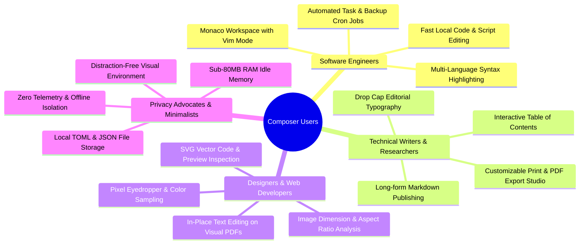
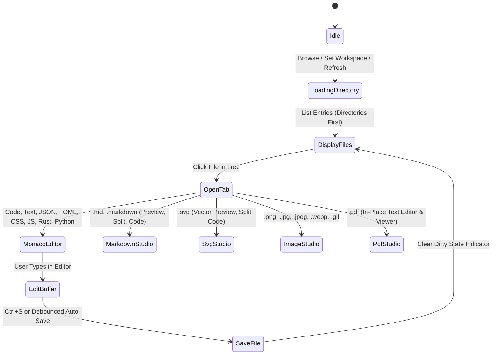
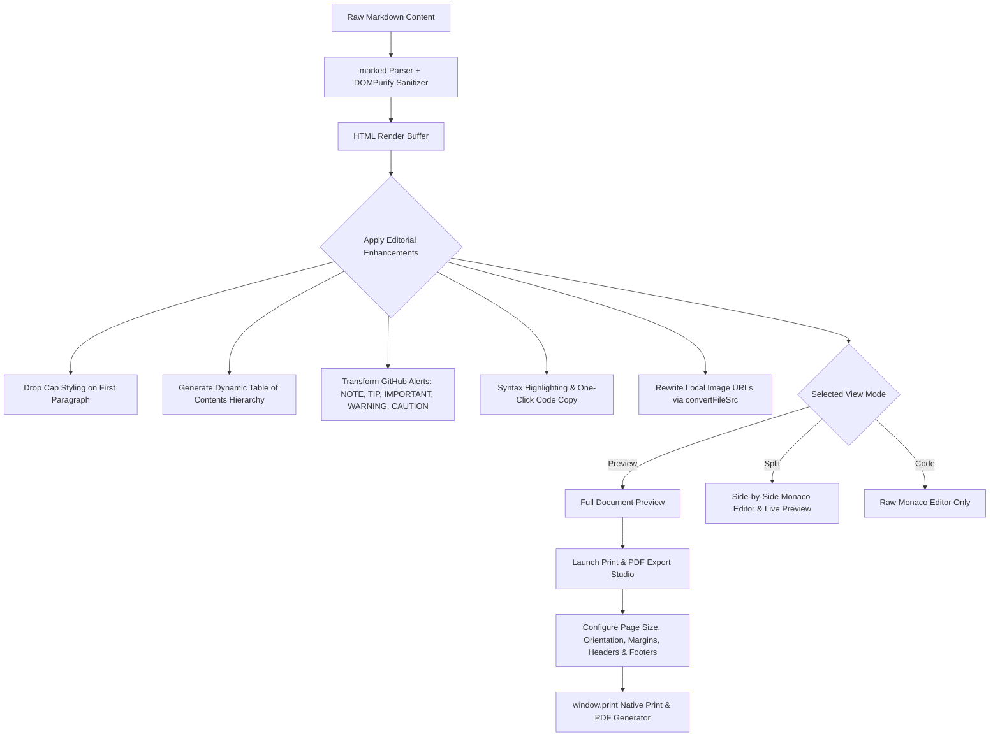
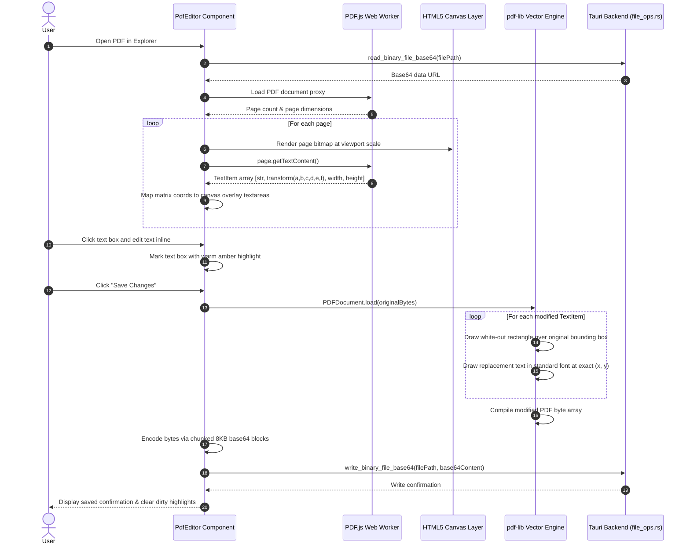
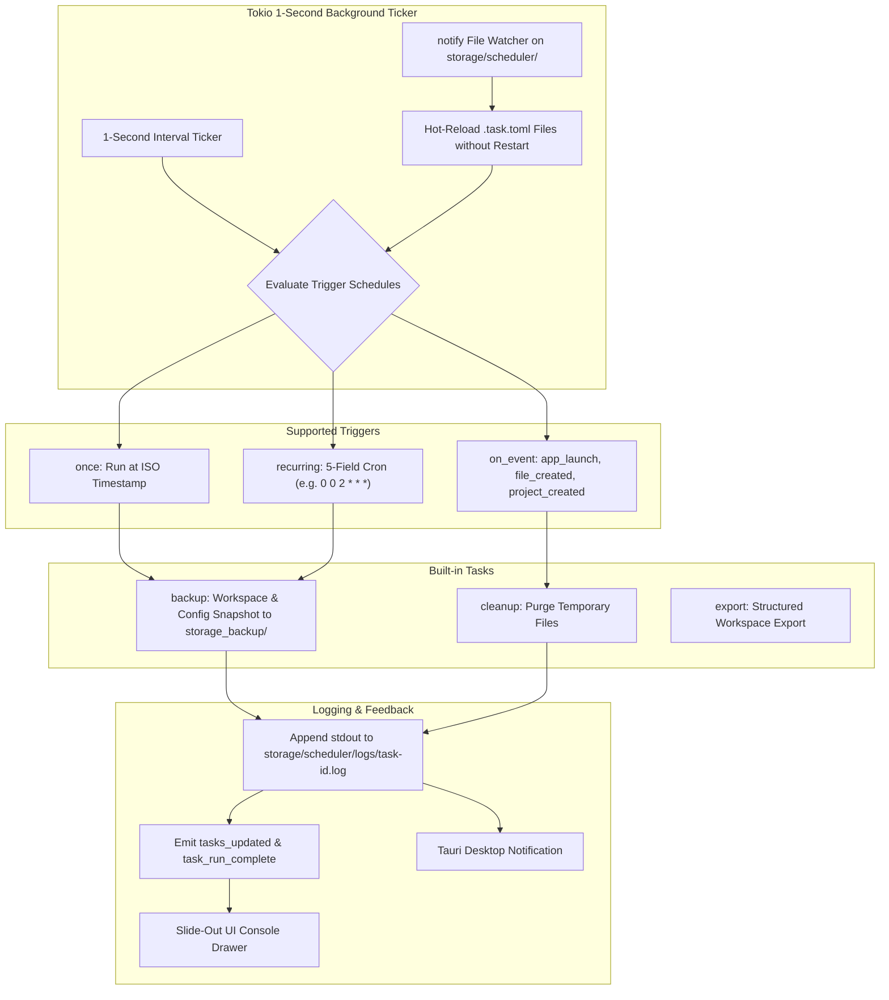
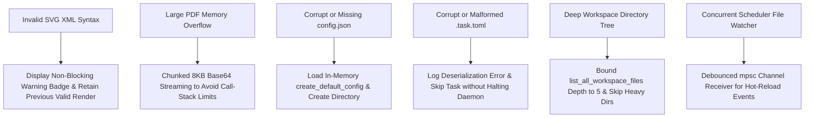
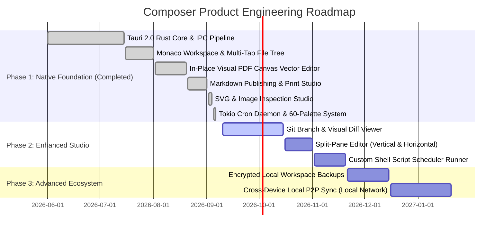

# Product Requirements Document (PRD): Composer Desktop

**Document Version:** 2.0.0  
**Product Name:** Composer  
**Product Category:** Local-First Desktop Creator Studio & Developer Workbench  
**Target Platform:** Desktop (Windows, macOS, Linux)  
**Tech Stack:** Tauri 2.0 + Rust 2021 + React 19 + TypeScript 5.8 + Vite 7 + Tailwind CSS v4 + Monaco Editor + PDF.js + pdf-lib  

---

## 1. Executive Summary & Product Vision

### 1.1 Vision Statement
**Composer** is an offline-first, local-native desktop creator studio and developer workbench that unifies VS Code-grade code editing, long-form Markdown publishing with a native print/PDF engine, in-place visual PDF text replacement, high-precision SVG vector inspection, an advanced pixel-level image inspector with an eyedropper, and background cron task automation—all wrapped within an exquisite, highly customizable editorial design system.

### 1.2 Core Value Propositions
* **100% Local, Offline & Private:** Zero cloud dependencies, zero external network requests, and zero telemetry. All documents, configurations, media assets, and scheduled routines remain strictly contained within the user’s local storage.
* **Instantaneous Performance & Micro Footprint:** Cold application startup in under 350ms, idle memory footprint under 80 MB RAM, zero native C++ compilation friction, and silky 60 FPS slider interactions.
* **Unified Creator Workbench:** Eliminates the need to switch between fragmented single-purpose applications by seamlessly integrating code editing, Markdown authoring, visual PDF editing, vector graphics analysis, and raster image inspection into a multi-tab workspace.
* **Proactive Background Automation:** A multi-threaded Tokio cron and event-driven automation engine that hot-reloads `.task.toml` configurations from disk via `notify` filesystem watchers, handling automated workspace snapshots, backups, and file housekeeping.
* **Bespoke Editorial Aesthetics:** A warm typography engine paired with high-contrast dark themes, 60+ curated palettes, a 3D rolling dice theme randomizer, typewriter-animated color controls, dynamic atmospheric accent glow, edge smoothness adjustments, and 6 interchangeable navigation layouts.

---

## 2. User Personas & Problem Space



### 2.1 Target Personas
1. **The Software Engineer & Power User:** Demands a swift, distraction-free code editor for quick workspace edits, configuration updates, and automated local cron jobs (e.g., periodic workspace backups and project exports) without launching heavy IDEs.
2. **The Technical Writer & Researcher:** Requires an elegant, distraction-free authoring environment with drop-cap styling, GitHub-style callouts, real-time word/reading metrics, and a full-featured print studio to generate publication-grade PDF documents.
3. **The Designer & Front-End Developer:** Needs to rapidly inspect SVG elements and paths, preview raster images with zoom/pan and pixel color sampling, and make quick text fixes directly inside existing PDF layouts without expensive, subscription-based PDF editors.
4. **The Privacy-Conscious Minimalist:** Rejects cloud lock-in, telemetry, and background tracking; values software that operates entirely offline on open, transparent file formats (JSON, TOML, Markdown).

### 2.2 Key Problems Solved
* **Subscription Fatigue & Cloud Lock-in:** Replaces recurring subscriptions for PDF editors, Markdown publishers, and automation utilities with a permanent, standalone native desktop binary.
* **Fragmented Creative Toolchain:** Consolidates code editing, document authoring, PDF modification, vector graphics inspection, and cron scheduling into one cohesive workspace.
* **Web Wrapper Resource Bloat:** Bypasses heavy Chromium-wrapped web apps by pairing Tauri 2.0 with a high-performance native Rust core, consuming less than 80 MB of RAM at idle.
* **Rigid UI Styling:** Overcomes dull, static developer tool interfaces through an adaptable editorial design system offering 60+ palettes, custom font pairings, and 6 dynamic layout structures.

---

## 3. System Architecture & High-Level Design

### 3.1 Architecture Overview
Composer is built upon a hybrid desktop architecture: a high-performance **Rust 2021** core managed by **Tauri v2** and **Tokio**, and a declarative presentation layer crafted with **React 19**, **TypeScript 5.8**, **Vite 7**, and **Tailwind CSS v4**.

```mermaid
graph TB
    subgraph Frontend ["Frontend Presentation Layer (React 19 + TypeScript + Vite 7)"]
        UI[App Shell, Custom Titlebar & Navigation Engine]
        EXP[Explorer & Multi-Tab Workspace]
        MONACO[Monaco Code Studio]
        MD[Markdown Publishing & Print Studio]
        PDF[In-Place Visual PDF Canvas Editor]
        SVG[SVG Vector Inspector]
        IMG[Image Studio & Pixel Eyedropper]
        SCHED[Automation Dashboard & Live Logs Console]
        SET[System Settings & 60+ Palette Engine]
        CTX[Universal Context Menu System]
    end

    subgraph IPC ["Tauri 2.0 Native IPC Bridge"]
        INVOKE[Tauri Command Invocation (27 Registered Commands)]
        EVENTS[Asynchronous Event Bus (tasks_updated, task_run_start, task_run_complete, config_updated)]
    end

    subgraph Backend ["Native Backend Core (Rust 2021 / Tokio / Tauri Core)"]
        LIB[lib.rs Command Dispatcher & Lifecycle Hooks]
        CONF[config.rs App Configuration & Theme TOML I/O]
        FOPS[file_ops.rs Filesystem Walker & Base64 I/O]
        TASK[scheduler.rs Tokio Background Cron Daemon & notify Watcher]
    end

    subgraph Storage ["Local Storage Directory (/storage)"]
        CFG[config.json Master Configuration]
        TASK_TOML[scheduler/*.task.toml Automation Tasks]
        LOGS[scheduler/logs/*.log Task Execution Logs]
        THEMES[users/*.json Custom Theme Presets]
        BACKUP[storage_backup/ Automated Workspace Snapshots]
    end

    UI --> INVOKE
    EXP --> INVOKE
    MONACO --> INVOKE
    MD --> INVOKE
    PDF --> INVOKE
    SVG --> INVOKE
    IMG --> INVOKE
    SCHED --> INVOKE
    SET --> INVOKE

    EVENTS --> UI
    EVENTS --> SCHED
    EVENTS --> SET

    INVOKE --> LIB
    LIB --> CONF
    LIB --> FOPS
    LIB --> TASK

    CONF --> CFG
    CONF --> THEMES
    FOPS --> Storage
    TASK --> TASK_TOML
    TASK --> LOGS
    TASK --> BACKUP
```

### 3.2 Technology Stack

| Layer | Technology | Version | Purpose / Role |
| :--- | :--- | :--- | :--- |
| **Desktop Shell** | Tauri | v2.0 | Native OS windowing, file dialogs, system menus, secure IPC bridge |
| **Backend Core** | Rust | 2021 Edition | High-performance filesystem I/O, base64 transcoding, hardware memory polling |
| **Async Runtime** | Tokio | v1.0 | Multi-threaded async background executor, ticker loops, time management |
| **Cron Parser** | `cron` crate | v0.12.1 | Standard 5-field and 6-field cron schedule parsing and next-execution calculation |
| **Filesystem Watcher** | `notify` crate | v6.1.1 | Native OS filesystem change notification for live hot-reloading of task definitions |
| **System Info** | `sys-info` crate | v0.9.1 | Real-time physical system RAM utilization telemetry |
| **UI Framework** | React | v19.1.0 | Declarative component hierarchy and fast DOM rendering |
| **Language & Build** | TypeScript + Vite | v5.8 / v7.0 | Strict type safety and instantaneous Hot Module Replacement (HMR) |
| **Code Editor** | Monaco Editor | v4.7.0 (`@monaco-editor/react`) | VS Code-grade code editor, syntax highlighting, diffs, vim bindings |
| **Markdown Engine** | Marked + DOMPurify | v14.0 / v3.2 | High-speed CommonMark/GFM parser and strict HTML sanitization |
| **PDF Rendering** | PDF.js (`pdfjs-dist`) | v6.0 | PDF page canvas rendering and text item matrix coordinate extraction |
| **PDF Manipulation** | `pdf-lib` | v1.17 | User-space non-destructive vector text modification and byte compiling |
| **Styling System** | Tailwind CSS | v4.3 | Dynamic CSS variable tokens, glassmorphism, responsive navigation layouts |
| **Icons & Motion** | Lucide React + Framer Motion | v1.16 / v12.4 | Modern iconography and fluid interface micro-animations |

---

## 4. Comprehensive Feature & Functional Specifications

---

### 4.1 Module 1: File Explorer & Workspace Studio



#### 4.1.1 Capabilities & Functional Rules
1. **Directory Tree & File Walker:**
   * Resizable sidebar with an interactive col-resize handle bounded between 160px and 600px.
   * Collapsible directory trees with recursive file navigation.
   * Deterministic sorting: directories are prioritized first, followed by files sorted alphabetically (case-insensitive).
   * Smart recursive file indexer (`list_all_workspace_files`) bounded to a maximum depth of 5 to preserve instant responsiveness while automatically filtering out heavy build artifacts (`node_modules`, `target`, `.git`, `dist`, `build`).
2. **Multi-Tab Document Workspace:**
   * Tab bar supporting multiple simultaneously open documents.
   * Dirty-state change indicator (`•`) displayed on tabs with unsaved buffer changes.
   * Visual multi-selection mode (`selectedPaths`) for batch workspace awareness.
   * Tab close controls and active tab switching.
3. **Workspace File Operations Modal & Context Menu:**
   * Native creation of new files and folders within any selected directory.
   * Native OS file and directory imports via `pick_file` and `pick_directory` copying into the active folder (`import_to_directory`).
   * Inline item renaming modal with collision validation (`rename_file_or_dir`).
   * Recursive deletion of files and folders (`delete_file_or_dir`).
   * Direct reveal in the native operating system file manager (`open_in_file_manager`).
   * Multi-version snapshot history tracking per file with one-click revision rollback.
   * Grid view versus compact list/tree view switcher.

---

### 4.2 Module 2: VS Code-Grade Monaco Code Studio

#### 4.2.1 Capabilities & Functional Rules
1. **Dynamic Theme Resolution:**
   * Automatically derives Monaco theme (`vs-dark` vs. `vs-light`) from active CSS theme luminance (`--theme-ink`), maintaining seamless visual parity with the app shell.
2. **Language Syntax Support:**
   * Auto-detection across 15+ common languages based on file extension: Rust (`.rs`), TypeScript (`.ts`, `.tsx`), JavaScript (`.js`, `.jsx`), Python (`.py`), Markdown (`.md`), HTML (`.html`), CSS (`.css`), JSON (`.json`), TOML (`.toml`), YAML (`.yaml`, `.yml`), SQL (`.sql`), Shell/Bash (`.sh`), and plain text.
3. **Typography & Layout Controls:**
   * Customizable font size (10px to 32px), line height (1.2 to 2.2), and tab size (2 or 4 spaces).
   * Word wrap toggle and minimized minimap for distraction-free code editing.
   * Optional Vim keybinding emulation toggle.
4. **Buffer Management & Auto-Save:**
   * Configurable debounced auto-save timer (default: 10 seconds).
   * Instant save keyboard shortcut (<kbd>Ctrl</kbd> + <kbd>S</kbd> / <kbd>Cmd</kbd> + <kbd>S</kbd>).

---

### 4.3 Module 3: Markdown Publishing & Print Studio



#### 4.3.1 Authoring & Layout Capabilities
1. **Three-Way View Switcher:**
   * **Preview Mode:** Dedicated full-window editorial reader view.
   * **Split Mode:** Side-by-side synchronized editing with Monaco on the left and real-time rendered preview on the right.
   * **Code Mode:** Maximized Monaco Markdown code editor.
2. **Editorial Typography & Elements:**
   * Drop cap styling on opening paragraphs for a classic publication look.
   * GitHub-style callouts/admonitions with custom icons and colored borders:
     * `[!NOTE]` (Informational highlight)
     * `[!TIP]` (Actionable advice)
     * `[!IMPORTANT]` (Critical operational notice)
     * `[!WARNING]` (Cautionary notice)
     * `[!CAUTION]` (High-risk warning)
   * Formatted tables, task checklists, blockquotes, and copyable code fences.
3. **Interactive Table of Contents (TOC):**
   * Automatically parses `h1` through `h6` headings.
   * Slide-out interactive TOC drawer with smooth scrolling and active section tracking.
4. **Reading Analytics:**
   * Real-time calculation of total word count, character count, and estimated reading time based on a standard 200 WPM reading speed.
5. **Print & PDF Export Studio (`PrintConfig`):**
   * Built-in dedicated print styling modal with customizable output parameters:
     * **Page Sizes:** Standard `A4`, US `Letter`, and `Legal`.
     * **Orientation:** `Portrait` or `Landscape`.
     * **Margins:** `Normal` (20mm), `Narrow` (10mm), or `Wide` (30mm).
     * **Typography:** `Serif` (EB Garamond), `Sans` (Inter), or `Mono` (JetBrains Mono).
     * **Print Themes:** `White` (clean paper), `Editorial` (subtle cream tone), or `Monochrome` (high contrast black & white).
     * **Structural Toggles:** Header with custom document title, footer with page numbers, embedded Table of Contents page, and drop cap styling.
   * Triggers native OS print subsystem with `@media print` CSS rules for lossless vector PDF export.
6. **Workspace Image Resolution:**
   * Resolves relative image paths against the current document location or workspace root using Tauri’s asset protocol (`convertFileSrc`), allowing local images (``) to render effortlessly.

---

### 4.4 Module 4: In-Place Visual PDF Canvas & Vector Text Editor



#### 4.4.1 Functional Rules & Engineering Details
1. **Zero-Layout-Shift Overlay Mapping:**
   * Text positions are calculated from PDF.js matrix transforms `[a, b, c, d, e, f]` and viewport scales.
   * Interactive textareas remain completely transparent until clicked, preserving the underlying PDF's native font rendering and graphic layout.
2. **Dirty Text Tracking:**
   * Modified text elements are visually highlighted in warm amber (`rgba(255, 220, 80, 0.40)`) with clear visual boundaries.
3. **Non-Destructive Vector Text Replacement:**
   * Modifying text does not rasterize the page. When saved, `pdf-lib` paints a precise white rectangle over the original coordinates to obscure the old text, then vectors in the replacement text string at the exact coordinate offset.
4. **Stack-Safe Chunked Base64 Streaming:**
   * Bypasses JavaScript browser call-stack limits on large files by converting binary `Uint8Array` data into base64 via 8,192-byte chunks before transmitting through Tauri IPC.
5. **Save & Save-As Dialogs:**
   * Supports in-place overwriting of the active PDF file or exporting to a new filename via `save_file_dialog`.

---

### 4.5 Module 5: Interactive SVG Vector Inspector & Studio

#### 4.5.1 Capabilities & Functional Rules
1. **Three-Way View Switcher:**
   * **Preview Mode:** Dedicated vector inspection canvas with zoom and pan.
   * **Split Mode:** Side-by-side editing with Monaco XML/SVG editor on the left and live vector canvas on the right.
   * **Code Mode:** Maximized Monaco editor displaying the raw SVG markup.
2. **Interactive Viewport:**
   * Smooth wheel zooming and drag-to-pan controls.
   * One-click zoom reset to fit 100%.
3. **Real-Time Non-Blocking XML Validation:**
   * Parses markup using browser `DOMParser`. If invalid XML is detected during editing, a discreet non-blocking error badge displays the parser error line while maintaining the previous valid render on canvas without crashing.
4. **Background Inspection Presets:**
   * Quick toggle across 5 preview backdrops: `Grid`, `Checkerboard` (transparency testing), `Paper` (theme background), `Dark`, and `Light`.
5. **Vector Element & Metric Inspector:**
   * Extracts and displays total DOM node count, `<path>` count, `viewBox` coordinates, natural pixel dimensions (`width` × `height`), and formatted file size.
6. **Actions & Lifecycle Management:**
   * One-click "Copy SVG Code" to clipboard.
   * One-click "Download SVG" file export.
   * Blob URL lifecycle isolation: automatically revokes obsolete `blob:` URLs to prevent memory leakage during live typing.

---

### 4.6 Module 6: Advanced Image Inspector Suite

```mermaid
graph LR
    subgraph Controls ["Viewport Navigation & Transforms"]
        ZOOM["Zoom: 25%, 50%, 100%, 200%, 400%, Fit"]
        PAN["Interactive Drag-to-Pan"]
        ROT["90° CW / CCW Rotation"]
        FLIP["Horizontal & Vertical Flip"]
    end

    subgraph Modes ["Display Modes"]
        BG["Backdrop: Grid / Checker / Paper / Dark / Light"]
        PIXEL["Nearest-Neighbor Pixelated Toggle"]
    end

    subgraph Analysis ["Analysis & Eyedropper"]
        CANVAS["Offscreen HTML5 Canvas"]
        SAMPLE["Pixel Color Sampling (HEX & RGB)"]
        META["Dimensions, Aspect Ratio, Megapixels, Size, Path"]
    end

    Controls --> Modes --> Analysis
```



#### 4.6.1 Capabilities & Functional Rules
1. **Viewport & Geometric Transforms:**
   * Fluid zoom controls with quick presets (25%, 50%, 100%, 200%, 400%, and Auto-Fit).
   * Interactive drag-and-drop viewport panning with boundary protection.
   * 90° clockwise and counter-clockwise rotation controls.
   * Horizontal and vertical axis flipping.
2. **Nearest-Neighbor Pixelated Toggle:**
   * Toggles CSS image rendering between `auto` (smooth bicubic interpolation) and `pixelated` (nearest-neighbor scaling), essential for inspecting pixel art, icons, textures, and sprites at high magnification.
3. **Canvas-Backed Pixel Eyedropper / Color Sampler:**
   * Samples pixel colors underneath the cursor in real-time from an offscreen HTML5 canvas buffer.
   * Displays instantaneous HEX and RGB color values alongside a live color preview swatch.
   * One-click copying of sampled hex codes directly to clipboard with visual toast confirmation.
4. **Metadata Inspector Panel:**
   * Displays natural image dimensions (width × height in pixels), calculated aspect ratio, total megapixels (MP), file format extension, formatted byte size, and full system filepath.
   * Quick action button to reveal the image in the native OS file explorer.
5. **Export & Clipboard:**
   * One-click "Copy Image" to system clipboard as a PNG blob.
   * One-click "Download Image" to local disk.

---

### 4.7 Module 7: Background Automation & Tokio Cron Scheduler



#### 4.7.1 Capabilities & Functional Rules
1. **Multi-Threaded Tokio Daemon:**
   * Background engine spawned upon application startup in `src-tauri/src/lib.rs`.
   * Continuous 1-second ticker loop evaluating task conditions with minimal CPU impact (<0.1%).
2. **Hot-Reloading Task Watcher:**
   * Utilizes the native OS `notify` crate to watch `storage/scheduler/`. Modifying or adding `.task.toml` files updates the active scheduler task memory immediately without restarting the application.
3. **Flexible Trigger Frequencies:**
   * `once`: Executes at a specific ISO DateTime string (`run_at`). Upon execution, the frequency automatically transitions to `"completed"` and disables the task.
   * `recurring`: Evaluates standard 5-field cron expressions using the `cron` crate (e.g., `0 0 2 * * *` for daily at 2:00 AM).
   * `on_event`: Event-driven execution triggered by application lifecycle hooks (`app_launch`, `file_created`, `project_created`).
4. **Built-In Operations:**
   * `backup`: Creates timestamped backups of `storage/config.json` and workspace assets into `storage_backup/`.
   * `cleanup`: Housekeeping routine purging temporary workspace caches.
   * `export`: Packages active workspace documents into structured archives.
5. **Dual Visual & Monaco TOML Editor:**
   * Form-based visual configuration for task name, frequency, cron expression, operation, and notification settings.
   * Full Monaco TOML editor mode with real-time bidirectional synchronization.
6. **Execution Telemetry & Logs Drawer:**
   * Each task execution writes timestamped execution logs to `storage/scheduler/logs/<task_id>.log`.
   * Slide-out UI console drawer allows live inspection of stdout and run history.
   * Manual instant execution trigger via `run_task_now`.
   * Desktop notifications via Tauri event dispatcher based on completion or failure triggers.

---

### 4.8 Module 8: Editorial Design System & Aesthetic Multi-Layout Engine

#### 4.8.1 Design System Tokens & Dynamic CSS Engine
Composer uses dynamic CSS custom properties applied directly to `document.documentElement.style`, enabling instant theme switching across the entire workspace with zero page reload:

| Token | Light Default | Dark Default | Description |
| :--- | :--- | :--- | :--- |
| `--theme-paper` | `#f6f2ea` | `#181410` | Primary application canvas and main background |
| `--theme-ink` | `#18140f` | `#ffffff` | Primary text and high-contrast foreground elements |
| `--theme-cream` | `#ede8dc` | `#221e1a` | Secondary surfaces, sidebars, cards, and modal panels |
| `--theme-rule` | `#c9bfab` | `#3c352a` | Structural borders, dividers, frame outlines |
| `--theme-accent` | `#b8440c` | `#b8440c` | Primary brand accent color, active buttons, focus rings |
| `--theme-muted` | `#8a7f6e` | `#a0988a` | Subtitle text, metadata, secondary icons |
| `--navbar-edge-smoothness`| `0px` | `0px` | Configurable corner radius for navigation bars |
| `--ui-edge-smoothness` | `4px` | `4px` | Configurable corner radius for UI cards and containers |
| `--theme-accent-glow` | `none` | `none` | Dynamic atmospheric neon glow box-shadow |

#### 4.8.2 60+ Curated Palettes & Theme Randomizer
* **Curated Presets:** Over 60 meticulously tailored color themes categorized into:
  * **Dark Themes:** Nord Slate, Cyber Phosphor, Crimson Night, Obsidian Stone, Synthwave Neon, Catppuccin Mocha, Midnight Blue, Terminal Amber.
  * **Light Themes:** Editorial Linen, Warm Parchment, Sandstone Cream, Vintage Rose, Crisp Minimalist White, Olive Press, Botanical Tea.
* **3D Rolling Dice Randomizer:** Rolling 3D dice button with a 360-degree rotation animation that selects random harmonized palettes for instant aesthetic discovery.
* **Typewriter-Animated Hex Inputs:** Smooth character-by-character typewriter animation when color codes are programmatically loaded or randomized.
* **Custom User Themes:** Allows saving custom palette overrides as JSON into `storage/users/<name>.json`, exporting themes to external `.toml` files (`export_theme_toml`), and importing existing themes (`import_theme_toml`).

#### 4.8.3 Typography Presets
Eight curated typography profiles combining display, text, and sans-serif Google and system fonts:
1. **Neo-Classical (Default):** EB Garamond (Body) + Playfair Display (Headings) + Inter (Metadata).
2. **Crisp Modern Sans:** Unified Inter for a sleek, technical appearance.
3. **Cyber Mono:** Unified JetBrains Mono for a developer-centric terminal aesthetic.
4. **Warm Retro:** Georgia + Courier New for a vintage press look.
5. **Geometric Sans:** Unified Outfit for an approachable contemporary feel.
6. **Space Monospace:** Space Mono for futuristic dashboard numerals.
7. **Fira Code Monospace:** Fira Code for tabular programming precision.
8. **Data Geometric:** Lexend engineered for numerical readability.

#### 4.8.4 Multi-Layout Navigation Engine
Composer supports 6 interchangeable navigation layouts selectable in real-time from Settings:
1. **Left Fixed Sidebar (Default):** Classic 200px–280px sidebar featuring brand typography, typewriter welcome message, navigation buttons, and real-time CPU RAM hardware meter.
2. **Right Fixed Sidebar:** Mirrored right-hand navigation optimized for RTL or multi-monitor workflows.
3. **Left Vertical Pills:** Ultra-compact 64px vertical icon rail maximizing editor screen width.
4. **Right Vertical Pills:** Mirrored compact vertical pill bar on the right.
5. **Top Horizontal Navbar:** 48px header bar with integrated navigation pills, page status, and system controls.
6. **Bottom Horizontal Navbar:** 48px footer bar keeping the top of the screen clear.
* **Icon-Only Mode:** Toggle to display compact icon navigation without text labels across all layout modes.

---

## 5. Non-Functional Requirements

### 5.1 Performance & Resource Targets
* **Cold Startup Time:** `< 350ms` from launch to interactive state (snappy launch phase unmounts splash screen gracefully at 350ms).
* **Memory Footprint:** Frontend idle RAM `< 50 MB`; background Rust runtime `< 25 MB` (Total idle application RAM `< 75 MB`).
* **UI Responsiveness:** 60 FPS slider interactions for color adjustments, glow brightness, and edge smoothness controls.
* **Large File Handling:** Seamless handling of text files up to 10 MB in Monaco, and chunked base64 streaming for multi-megabyte PDF documents.

### 5.2 Privacy & Security
* **Zero Telemetry:** No analytical tracking, user logging, or external heartbeat pings.
* **100% Offline Capability:** Operates with full fidelity in air-gapped environments without internet access.
* **Local Sandboxing:** All documents, tasks, and configurations are persisted strictly within the user’s designated local storage directory.
* **DOM Sanitization:** All rendered Markdown HTML is strictly sanitized via `DOMPurify` to eliminate XSS risks from untrusted documents.

### 5.3 Reliability & Fault Tolerance
* **Hot-Reloading File Watchers:** Scheduler tasks and theme configurations reload dynamically via `notify` without requiring an application restart.
* **Non-Blocking XML/SVG Errors:** Parsing errors in SVG or Markdown render informative inline warnings rather than crashing the workspace view.
* **Atomic File Writes:** Text and binary file operations ensure directory parents exist before committing bytes to disk.

---

## 6. Complete Data Models & Storage Schemas

### 6.1 Application Configuration (`storage/config.json`)

```json
{
  "general": {
    "app_name": "Composer",
    "language": "en",
    "date_format": "YYYY-MM-DD",
    "launch_page": "Explorer",
    "auto_update": false
  },
  "storage": {
    "root_path": "C:\\Users\\User\\Composer\\storage",
    "workspace_path": "C:\\Users\\User\\Projects"
  },
  "editor": {
    "font_family": "EB Garamond",
    "font_size": 17,
    "line_height": 1.6,
    "tab_size": 4,
    "auto_save_interval_sec": 10,
    "vim_mode": false,
    "max_versions_per_file": 20,
    "total_version_storage_limit_mb": 100
  },
  "scheduler": {
    "enabled": true,
    "default_notification_behavior": "fail_only",
    "log_retention_runs": 10,
    "retry_default": "none"
  },
  "theme": {
    "theme_preset": "light",
    "accent_color": "#b8440c",
    "background_override": "",
    "font_family_ui": "editorial",
    "font_size_ui": 14,
    "compact_mode": false,
    "reduce_motion": false,
    "nav_layout": "sidebar",
    "nav_sidebar_width": 224,
    "nav_show_app_label": true,
    "nav_show_status_bar": true,
    "nav_separator_line": true,
    "nav_separator_color": "#c9bfab",
    "nav_glass_effect": false,
    "ui_overrides": {
      "nav_background": "#f6f2ea",
      "content_background": "#f6f2ea",
      "card_background": "#ede8dc",
      "card_border": "#c9bfab",
      "text_color": "#18140f",
      "border_accent": "#b8440c",
      "navbar_edge_smoothness": "0px",
      "ui_edge_smoothness": "4px",
      "accent_glow": "false",
      "accent_glow_brightness": "1.0",
      "nav_icon_only": "false"
    }
  }
}
```

### 6.2 Scheduled Task Definition (`storage/scheduler/<task_id>.task.toml`)

```toml
[task]
id = "auto-workspace-backup"
name = "Workspace Daily Backup"
description = "Automated snapshot backup of active workspace documents"
type = "app"
enabled = true
created_at = "2026-09-01T00:00:00+00:00"
last_run = "2026-09-06T02:00:00+00:00"
last_status = "success"

[schedule]
frequency = "recurring" # "once" | "recurring" | "on_event"
run_at = ""
cron = "0 0 2 * * *"
human_readable = "Every day at 02:00 AM"
event = "app_launch"

[action]
operation = "backup" # "backup" | "cleanup" | "export"
source_path = ""
destination_path = ""

[notifications]
on_start = false
on_complete = true
on_fail = true
include_result_preview = true
```

### 6.3 Custom User Theme Schema (`storage/users/<name>.json`)

```json
{
  "name": "Nordic Slate",
  "colors": {
    "nav_background": "#1b222c",
    "text_color": "#e5ecef",
    "card_background": "#222a36",
    "card_border": "#2e3b4e",
    "border_accent": "#88c0d0"
  }
}
```

---

## 7. Tauri IPC API & Rust Commands Matrix (27 Registered Commands)

Every command listed below is strictly implemented in `src-tauri/src/lib.rs` and actively callable by the frontend via `@tauri-apps/api/core::invoke`:

| # | Domain | Command Name | Rust Arguments | Return Type | Functional Description |
| :- | :--- | :--- | :--- | :--- | :--- |
| 1 | **System** | `greet` | `name: &str` | `String` | Connectivity test and handshake confirmation |
| 2 | **System** | `pick_directory` | *None* | `Option<String>` | Opens native OS folder picker dialog; returns path string or None |
| 3 | **System** | `pick_file` | *None* | `Option<String>` | Opens native OS file picker dialog; returns chosen path string |
| 4 | **System** | `save_file_dialog` | `default_name: Option<String>`, `default_dir: Option<String>` | `Option<String>` | Opens native OS save dialog for exporting PDFs and files |
| 5 | **System** | `import_to_directory` | `source_path: String`, `dest_dir: String` | `Result<String, String>` | Copies external file or directory tree into destination folder |
| 6 | **System** | `get_system_ram_usage` | *None* | `u8` | Returns current physical CPU system RAM utilization percentage (0–100%) |
| 7 | **Config** | `get_app_config` | *None* | `AppConfig` | Reads and parses active configuration from `storage/config.json` |
| 8 | **Config** | `save_app_config` | `config: AppConfig` | `Result<(), String>` | Serializes and persists configuration updates to disk |
| 9 | **Config** | `export_theme_toml` | `theme: ThemeConfig`, `export_path: String` | `Result<(), String>` | Exports current theme and UI overrides to an external `.toml` preset |
| 10 | **Config** | `import_theme_toml` | `import_path: String` | `Result<ThemeConfig, String>` | Imports and validates a theme preset from an external `.toml` file |
| 11 | **Config** | `get_app_install_path` | *None* | `String` | Resolves absolute directory path containing the running application executable |
| 12 | **Config** | `get_workspace_path` | *None* | `String` | Resolves current active workspace root path |
| 13 | **Scheduler**| `load_scheduler_tasks` | *None* | `Vec<ScheduledTask>` | Reads all scheduled task `.task.toml` definitions from disk |
| 14 | **Scheduler**| `save_scheduler_task` | `task: ScheduledTask` | `Result<(), String>` | Persists or updates a task definition file in `storage/scheduler/` |
| 15 | **Scheduler**| `delete_scheduler_task`| `id: String` | `Result<(), String>` | Removes the `.task.toml` file matching the specified task ID |
| 16 | **Scheduler**| `run_task_now` | `id: String` | `Result<(), String>` | Instantly triggers execution of a scheduled task in the background |
| 17 | **Scheduler**| `get_task_run_logs` | `id: String` | `Result<String, String>` | Reads execution log history from `storage/scheduler/logs/<id>.log` |
| 18 | **FileOps** | `list_directory_contents` | `dir_path: String` | `Result<Vec<FileEntry>, String>` | Lists files and subfolders for the directory tree (folders first) |
| 19 | **FileOps** | `list_all_workspace_files`| *None* | `Result<Vec<FileEntry>, String>` | Recursive file indexer (depth <= 5, excluding heavy build directories) |
| 20 | **FileOps** | `read_text_file` | `file_path: String` | `Result<String, String>` | Reads UTF-8 text file contents into memory |
| 21 | **FileOps** | `write_text_file` | `file_path: String`, `content: String` | `Result<(), String>` | Writes UTF-8 string to file, creating parent directories if needed |
| 22 | **FileOps** | `read_binary_file_base64` | `file_path: String` | `Result<String, String>` | Reads binary file (PDF, PNG, etc.) and returns base64 string |
| 23 | **FileOps** | `write_binary_file_base64`| `file_path: String`, `base64_content: String` | `Result<(), String>` | Decodes base64 string and writes raw bytes to destination path |
| 24 | **FileOps** | `create_new_file` | `parent_dir: String`, `name: String` | `Result<String, String>` | Creates a new empty file inside the specified parent folder |
| 25 | **FileOps** | `create_new_folder` | `parent_dir: String`, `name: String` | `Result<String, String>` | Creates a new directory inside the specified parent folder |
| 26 | **FileOps** | `delete_file_or_dir` | `path: String` | `Result<(), String>` | Recursively deletes file or folder from the filesystem |
| 27 | **FileOps** | `rename_file_or_dir` | `old_path: String`, `new_name: String` | `Result<String, String>` | Renames file or directory in place |

---

## 8. UI/UX Interaction Design & Global Shortcuts

### 8.1 Key Bindings & Navigational Shortcuts

| Key / Event | Context | Action Performed |
| :--- | :--- | :--- |
| <kbd>Ctrl</kbd> + <kbd>S</kbd> / <kbd>Cmd</kbd> + <kbd>S</kbd> | Monaco Editor | Saves currently active document buffer to disk |
| <kbd>Ctrl</kbd> + <kbd>F</kbd> / <kbd>Cmd</kbd> + <kbd>F</kbd> | Explorer | Focuses and selects the workspace file search input |
| <kbd>F5</kbd> / <kbd>Ctrl</kbd> + <kbd>R</kbd> | Global | Reloads application webview and restarts UI state |
| <kbd>F11</kbd> | Global | Toggles borderless fullscreen window mode |
| <kbd>Mouse 4</kbd> (Side Button) | Global | Navigates to previous page in the main navigation menu |
| <kbd>Mouse 5</kbd> (Side Button) | Global | Navigates to next page in the main navigation menu |
| <kbd>Right-Click</kbd> | Tree / Cards | Spawns custom contextual action menu (Rename, Delete, Reveal, Run Now) |
| <kbd>Escape</kbd> | Modals | Closes open dialogs, settings drawers, or preview overlays |

---

## 9. Edge Cases & Resilience Engineering



---

## 10. Product Roadmap & Future Milestones



* **Milestone 1: Git Integration & Visual Diff Comparator**
  * Introduce native local Git status tracking in the Explorer sidebar alongside a Monaco side-by-side visual diff viewer for code and Markdown documents.
* **Milestone 2: Multi-Pane Split Editor**
  * Support arbitrary vertical and horizontal tab pane splitting, allowing simultaneous editing of code, Markdown preview, and PDF viewing side by side.
* **Milestone 3: Shell Script & Executable Task Runners**
  * Expand the Tokio background scheduler to support executing user-defined shell scripts (`.bat`, `.sh`, `.ps1`) and external CLI utilities with real-time stdout capture.
