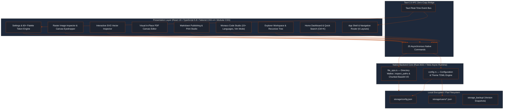
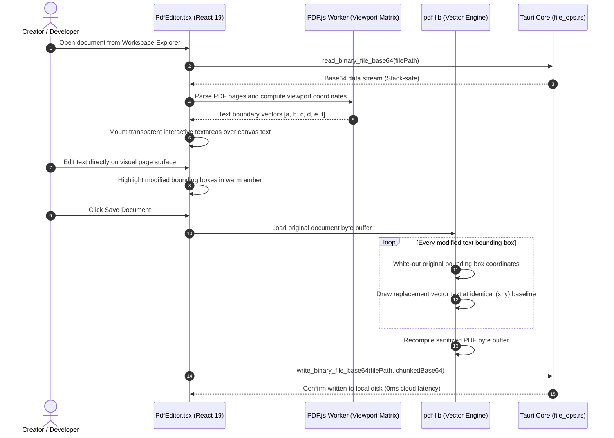

<div align="center">


# Composer

### *The Local-Native, Privacy-First Desktop Creator Studio & Developer Workbench*

[](https://tauri.app/)
[](https://www.rust-lang.org/)
[](https://react.dev/)
[](https://www.typescriptlang.org/)
[](https://tailwindcss.com/)
[](https://vitejs.dev/)
[](https://microsoft.github.io/monaco-editor/)
[](https://github.com/)
[](LICENSE)

<br/>

<p align="center">
  <b>⚡ &lt; 350ms Launch</b> &nbsp;•&nbsp;
  <b>🪶 &lt; 80 MB Idle RAM</b> &nbsp;•&nbsp;
  <b>🛡️ Zero Cloud Dependencies</b> &nbsp;•&nbsp;
  <b>🔒 100% Offline & Isolated</b>
</p>

<p align="center">
  <a href="#-why-composer">Why Composer</a> •
  <a href="#-studio-modules">Studio Modules</a> •
  <a href="#-system-architecture">Architecture</a> •
  <a href="#-download--installation">Download & Install</a> •
  <a href="#-quick-start">Quick Start</a> •
  <a href="#-visual-deep-dives">Deep Dives</a> •
  <a href="#-configuration--keybindings">Config & Keys</a> •
  <a href="#-recent-updates">Recent Updates</a>
</p>

---

</div>

<br/>

## 🧭 Why Composer?

Most modern desktop productivity suites have become bloated Chromium wrappers reliant on persistent internet connectivity, third-party cloud synchronization, and invasive telemetry.

**Composer** takes a radical local-native approach:

> **Engineered with Tauri 2.0 and Rust**, Composer fuses VS Code-grade code editing, book-quality Markdown publishing, direct in-place PDF vector text replacement, interactive SVG vector inspection, and pixel-level raster image analysis into **one unified, hyper-responsive desktop sanctuary.**

<table>
<tr>
<td width="33%" align="center">
<b>🛡️ Privacy Sovereign</b><br/>
<sub>Zero telemetry, zero analytics, zero external network requests. Your files never leave your disk.</sub>
</td>
<td width="33%" align="center">
<b>⚡ Zero-Bloat Performance</b><br/>
<sub>Cold-launches in under 350ms, operates with a sub-80 MB memory footprint, and runs without idle background daemons.</sub>
</td>
<td width="33%" align="center">
<b>🎨 Editorial Aesthetic</b><br/>
<sub>60+ curated color palettes, 3D dice randomizer, 8 font profiles, and 6 dynamic navigation layouts.</sub>
</td>
</tr>
</table>

<br/>

---

## 🎛️ Studio Modules

Composer unifies seven specialized creator studios and an instant workspace launcher into a single, cohesive desktop experience:

<table>
<tr>
<td width="50%" valign="top">

### 🏠 1. Home Dashboard & Quick Launcher
* **System-Aware Greeting & Live Clock:** Automatically adapts greeting to current system hour with a live digital clock and date banner.
* **Global Workspace Search (<kbd>Ctrl</kbd>+<kbd>K</kbd>):** Instant fuzzy search across all workspace files with keyboard traversal (<kbd>↑</kbd>/<kbd>↓</kbd>/<kbd>Enter</kbd>).
* **Smart Recent Files Tracker:** Real-time path inspection (`inspect_paths`) flags missing or renamed files, with relative timestamps and one-click removal.
* **Quick Action Triggers:** One-click shortcuts to open projects, create files/folders, or import assets.

</td>
<td width="50%" valign="top">

### 💻 2. Monaco Code Studio
* **VS Code Engine:** High-performance Monaco editor with syntax highlighting for 15+ programming languages.
* **Pro Ergonomics:** Vim mode keybindings, auto-save interval engine, dirty-state change indicator (`•`), and multi-tab switcher.
* **Luminance Sync:** Automatically syncs editor theme (`vs-dark` vs `vs-light`) to the active theme's `--theme-ink` brightness.

</td>
</tr>
<tr>
<td width="50%" valign="top">

### 📄 3. In-Place PDF Canvas Editor
* **Vector Text Replacement:** Edit text inside existing PDF documents without layout shift or cloud software.
* **Canvas Coordinate Overlay:** High-precision text block alignment mapped via PDF.js viewport matrices.
* **Stack-Safe Chunking:** Serializes multi-megabyte PDFs using 8KB binary chunks to prevent browser stack overflows.

</td>
<td width="50%" valign="top">

### 📝 4. Markdown Print & Publish Studio
* **Three-Way View:** Seamlessly toggle between **Preview**, **Split Mode** (Monaco + live renderer), and **Code**.
* **Print Studio Modal:** Native A4, Letter, and Legal export with margins, headers/footers, TOC page, and drop cap styling.
* **Local Asset Resolution:** Directly renders relative image paths (``) through Tauri's zero-copy asset bridge.

</td>
</tr>
<tr>
<td width="50%" valign="top">

### 🔍 5. Interactive SVG Vector Inspector
* **Live Inspection Canvas:** Smooth mousewheel zoom, drag-to-pan, and 5 backdrop presets (`Grid`, `Checkerboard`, `Paper`, etc.).
* **Split XML Editor:** Live Monaco XML editor on the left, instant vector canvas update on the right.
* **Resilient Parsing:** Real-time syntax error warnings that preserve the last valid render without crashing the view.

</td>
<td width="50%" valign="top">

### 🖼️ 6. Image Studio & Pixel Eyedropper
* **Nearest-Neighbor Scaling:** Switch from bicubic filtering to sharp nearest-neighbor interpolation for pixel art and icons.
* **Real-time Canvas Eyedropper:** Sample exact pixel RGBA and HEX values directly from an off-screen HTML5 buffer.
* **Full Viewport Suite:** 25%–400% zoom, 90° rotation, horizontal/vertical flipping, and comprehensive image metadata cards.

</td>
</tr>
<tr>
<td colspan="2" valign="top">

### 🎨 7. Minimalist & Editorial Design System
* **Modular CSS Architecture:** Clean separation of concerns with `tokens.css`, `shell.css`, `explorer.css`, `home.css`, `settings.css`, `dialogs.css`, and `components.css`.
* **60+ Curated Palettes & 8 Font Pairings:** Dark and light themes (Nord Slate, Obsidian, Editorial Linen) with dynamic Google Fonts typography (Neo-Classical, Crisp Sans, Cyber Mono, etc.).
* **6 Dynamic Layouts & Randomizer:** Left/Right fixed sidebars, ultra-slim icon pills, Top/Bottom navigation bars, and a 3D rolling dice theme randomizer.

</td>
</tr>
</table>

<br/>

---

## 🏗️ System Architecture

Composer couples an asynchronous **Rust native core** with a reactive **React 19 / TypeScript** presentation layer over Tauri 2.0's zero-copy IPC bridge.



<br/>

---

## 🔬 Visual Deep Dives

### In-Place PDF Vector Text Replacement Engine

Composer replaces text inside existing PDF documents non-destructively by extracting matrix coordinates and redrawing vector text at exact offsets:



<br/>

---

## 📦 Download & Installation

Standalone Windows desktop releases are compiled and published automatically:

👉 **[Download Latest Composer for Windows (.exe)](https://github.com/zishan049/Composer/releases/latest)**

1. Download `Composer_<version>_x64-setup.exe` from the [GitHub Releases](https://github.com/zishan049/Composer/releases) section.
2. Launch the installer and follow the setup prompts.

> [!IMPORTANT]
> ### 🛡️ Windows Defender SmartScreen Warning Notice
> 
> When installing Composer, Microsoft Defender SmartScreen may display:
> 
> **"Windows protected your PC — Microsoft Defender SmartScreen prevented an unrecognized app from starting. Running this app might put your PC at risk."**
> 
> <br/>
> 
> **Why does this appear?**
> * Composer is an independent, community-driven open-source project.
> * Microsoft SmartScreen automatically displays this warning on **any newly compiled binary** that has not yet accumulated thousands of downloads or does not possess an expensive commercial Extended Validation (EV) certificate.
> * The installer is generated directly by automated GitHub Actions from the open-source code in this repository.
> 
> **How to proceed with installation:**
> 1. Click **"More info"** on the SmartScreen dialog.
> 2. Click the **"Run anyway"** button that appears.
> 
> *Alternative (Unblock via File Properties):*
> 1. Right-click the downloaded `Composer_..._setup.exe` file and select **Properties**.
> 2. At the bottom of the **General** tab, check the **Unblock** checkbox.
> 3. Click **Apply**, then **OK**, and launch the installer normally.
> 
> **Privacy & Security Guarantee:**
> Composer is **100% offline, privacy-first, and contains zero analytics, tracking, or network telemetry.** All source code is completely open for review.

<br/>

---

## ⚡ Quick Start

### Prerequisites

| Tool | Minimum Version | Note |
|---|---|---|
| **Node.js** | `v20.x` or `v22.x` | With `npm` or `pnpm` |
| **Rust & Cargo** | `1.78+` (2021 Edition) | Install via [rustup.rs](https://rustup.rs/) |
| **C++ Build Tools** | Visual Studio 2022 *(Windows)* / Xcode *(macOS)* / WebKitGTK *(Linux)* | Required for native Tauri webview compilation |

### Installation

```bash
# 1. Clone the repository
git clone https://github.com/your-username/composer.git
cd composer

# 2. Install frontend dependencies
npm install 

# 3. Launch live development environment (Vite + Tauri Desktop Shell)
npm run tauri dev
```

### Production Build

To compile a standalone, optimized native executable:

```bash
npm run tauri build
```

The optimized binary will be produced in `src-tauri/target/release/bundle/`.

<br/>

---

## ⚙️ Configuration & Keybindings

<details>
<summary><b>🛠️ Application Configuration Schema (<code>storage/config.json</code>)</b></summary>

<br/>

Composer stores all runtime state in clean, transparent JSON files under your local storage directory:

```json
{
  "general": {
    "app_name": "Composer",
    "language": "en",
    "date_format": "YYYY-MM-DD",
    "launch_page": "Explorer",
    "auto_update": false
  },
  "storage": {
    "root_path": "C:\\Users\\User\\Composer\\storage",
    "workspace_path": "C:\\Users\\User\\Projects"
  },
  "editor": {
    "font_family": "EB Garamond",
    "font_size": 17,
    "line_height": 1.6,
    "tab_size": 4,
    "auto_save_interval_sec": 10,
    "vim_mode": false,
    "max_versions_per_file": 20,
    "total_version_storage_limit_mb": 100
  },
  "theme": {
    "theme_preset": "nord-slate",
    "accent_color": "#b8440c",
    "nav_layout": "sidebar",
    "nav_sidebar_width": 224,
    "ui_overrides": {
      "nav_background": "#1e2430",
      "text_color": "#f8fafc",
      "card_background": "#161b24",
      "card_border": "#2d3748",
      "border_accent": "#b8440c",
      "ui_edge_smoothness": "6px",
      "navbar_edge_smoothness": "0px"
    }
  }
}
```

</details>

<details>
<summary><b>⌨️ Global Shortcuts & Keybindings Reference</b></summary>

<br/>

| Shortcut | Scope | Action |
| :--- | :--- | :--- |
| <kbd>Ctrl</kbd> + <kbd>K</kbd> / <kbd>Cmd</kbd> + <kbd>K</kbd> | Global | Focus & reveal Home workspace quick search input |
| <kbd>Ctrl</kbd> + <kbd>S</kbd> / <kbd>Cmd</kbd> + <kbd>S</kbd> | Monaco Code Studio | Save active document buffer to disk |
| <kbd>Ctrl</kbd> + <kbd>F</kbd> / <kbd>Cmd</kbd> + <kbd>F</kbd> | Explorer / Home | Focus file search in Explorer (or Home search if on Home) |
| <kbd>F5</kbd> / <kbd>Ctrl</kbd> + <kbd>R</kbd> | Global | Reload application webview window |
| <kbd>F11</kbd> | Global | Toggle borderless fullscreen mode |
| <kbd>Mouse 4</kbd> / <kbd>Mouse 5</kbd> | Navigation Router | Step backward / forward across navigation views |
| <kbd>Right-Click</kbd> | File Cards & Workspace Tree | Open custom context menu (Rename, Delete, Reveal, Run) |
| <kbd>Escape</kbd> | Modals & Overlays | Dismiss active dialogs, settings drawer, or print modal |

</details>

<details>
<summary><b>📂 Repository Directory Structure</b></summary>

<br/>

```
Composer/
├── 📁 .github/                # GitHub Actions CI/CD workflows
│   └── 📁 workflows/
│       └── 📄 release.yml     # Automated release pipeline, NSIS installer & updater signatures
├── 📁 public/                 # Static web assets & application icons
├── 📁 src/                    # Frontend presentation layer (React 19 + TypeScript 5.8)
│   ├── 📁 assets/             # Brand logos & static vector assets
│   ├── 📁 components/         # Core studio modules & navigation views
│   │   ├── 📄 ContextMenu.tsx     # Custom native-like context action menu
│   │   ├── 📄 Explorer.tsx        # Multi-tab workspace tree & file browser
│   │   ├── 📄 Home.tsx            # Home dashboard, quick launcher & live clock
│   │   ├── 📄 ImagePreview.tsx    # Raster image inspector & canvas eyedropper
│   │   ├── 📄 MarkdownFileIcon.tsx# Specialized SVG filetype icon for Markdown
│   │   ├── 📄 MarkdownPreview.tsx # Markdown publishing & print studio
│   │   ├── 📄 Onboarding.tsx      # First-run guided setup & storage onboarding wizard
│   │   ├── 📄 PdfEditor.tsx       # In-place visual PDF text replacement canvas
│   │   ├── 📄 Settings.tsx        # 60+ palette engine, typography & layout settings
│   │   ├── 📄 SvgFileIcon.tsx     # Specialized SVG filetype icon for vectors
│   │   └── 📄 SvgPreview.tsx      # Interactive SVG vector code & canvas inspector
│   ├── 📁 styles/             # Modular CSS architecture
│   │   ├── 📄 components.css      # Reusable atomic UI buttons & controls
│   │   ├── 📄 dialogs.css         # Modal overlays, rename & import dialogs
│   │   ├── 📄 explorer.css        # Workspace tree, tab bars & dirty indicators
│   │   ├── 📄 home.css            # Home greeting, search & quick action cards
│   │   ├── 📄 settings.css        # Settings panels, theme grid & 3D dice
│   │   ├── 📄 shell.css           # Window frame, titlebar & 6 navigation layouts
│   │   └── 📄 tokens.css          # Semantic design tokens & color variables
│   ├── 📁 utils/              # Client utility engines
│   │   ├── 📄 fonts.ts            # Dynamic Google Fonts loader & 8 typography presets
│   │   └── 📄 recentFiles.ts      # LocalStorage recent files tracker & time formatter
│   ├── 📄 App.tsx             # Root desktop shell & 6-layout navigation router
│   ├── 📄 index.css           # Tailwind CSS v4 @theme bridge & base styles
│   ├── 📄 main.tsx            # React application bootstrap entrypoint
│   └── 📄 types.ts            # TypeScript data models and IPC definitions
├── 📁 src-tauri/              # Native backend core (Rust 2021 + Tauri 2.0)
│   ├── 📁 capabilities/       # Tauri security policies & permission sets
│   ├── 📁 icons/              # Multi-resolution desktop application icons
│   ├── 📁 src/                # Rust backend modules
│   │   ├── 📄 config.rs       # App configuration loader, watcher & theme TOML I/O
│   │   ├── 📄 file_ops.rs     # Directory tree walker, inspect_paths & base64 I/O
│   │   ├── 📄 lib.rs          # Tauri command dispatcher (25 commands) & lifecycle
│   │   └── 📄 main.rs         # Native binary desktop entrypoint
│   ├── 📄 Cargo.toml          # Rust dependencies & compiler optimization flags
│   └── 📄 tauri.conf.json     # Tauri 2.0 window configuration & security settings
├── 📄 PRD.md                  # Comprehensive Product Requirements Document (PRD v2.1.0)
├── 📄 package.json            # Node.js dependencies & scripts manifest
├── 📄 tsconfig.json           # TypeScript compilation configuration
└── 📄 vite.config.ts          # Vite bundler configuration & worker aliases
```

</details>

<br/>

---

## 🗺️ Roadmap

- [x] **v1.0 — Local Desktop Creator Studio**
  - [x] High-performance Tauri 2.0 + Rust async backend (<350ms launch, <80MB RAM)
  - [x] Monaco code studio with multi-tab workspace, vim mode, and 15+ syntax highlighters
  - [x] In-place direct vector text replacement for PDFs via `pdf-lib` and `pdfjs-dist`
  - [x] Markdown publishing studio with A4/Letter/Legal print & PDF export engine
  - [x] Interactive SVG vector inspector with live XML Monaco split view
  - [x] Image inspector suite with nearest-neighbor scaling and canvas pixel eyedropper
  - [x] 60+ curated color palettes, 3D rolling dice randomizer, and 6 dynamic navigation layouts
  - [x] Home Dashboard with dynamic time-aware greeting, live clock, and quick actions
  - [x] Global fuzzy search overlay (<kbd>Ctrl</kbd>+<kbd>K</kbd>) across workspace files
  - [x] Smart recent files registry with real-time `inspect_paths` path existence validation
  - [x] Modular CSS architecture with semantic tokens and high-contrast B&W defaults
  - [x] 8 typography presets with dynamic Google Fonts runtime injection

<br/>

---

## 🚀 Recent Updates

### 🌟 v0.1.0 — Onboarding & Release Automation

* **✨ Interactive First-Run Onboarding Flow:**
  * Implemented a welcoming 4-step first-run wizard ([`Onboarding.tsx`](src/components/Onboarding.tsx)) for new installations.
  * Guides users through greeting, custom storage location configuration, workspace directory selection, and instant workspace indexation.
* **📦 Automated CI/CD Release & Update Pipeline:**
  * Created an automated GitHub Actions release workflow ([`release.yml`](.github/workflows/release.yml)) triggered on version tags (`v*`).
  * Compiles standalone optimized Windows executables and bundles them as NSIS installers.
  * Automatically generates cryptographic updater signatures (`.sig` & `latest.json`) for seamless future in-app updates.
* **🗂️ Workspace Selection & Directory Switching Polish:**
  * Upgraded native folder pickers with directory validation and normalized path handling.
  * Fixed workspace switching so users can easily change or re-index active project folders without UI desynchronization.
* **🏷️ Application Branding & Identity:**
  * Standardized application naming, metadata, and taskbar branding across the installer, system tray/dock, and window frame.
* **🛡️ Windows Defender SmartScreen Transparency:**
  * Documented clear verification steps and run-through instructions for Windows SmartScreen on newly compiled open-source releases.

<br/>

**Bespoke aesthetics, uncompromising speed, and complete privacy for creators and developers.**

<sub>Crafted with precision using Tauri 2.0, Rust, React 19, Vite, and Tailwind CSS v4</sub>

</div>
