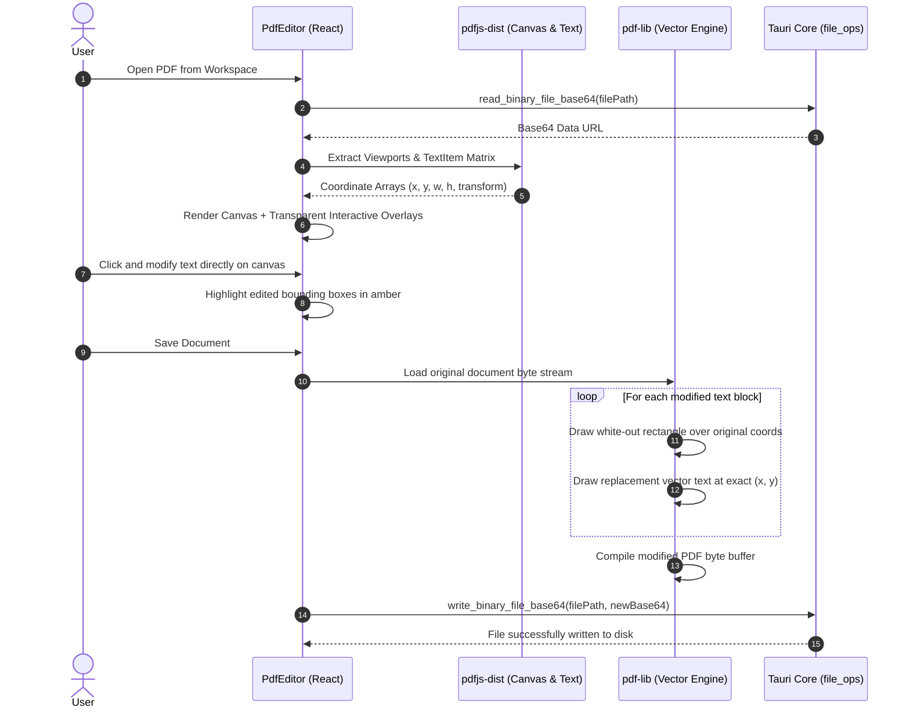

<div align="center">


# 🎼 Composer

**The Offline-First, Local-Native Desktop AI Workspace & Creator Studio**

[](https://tauri.app/)
[](https://www.rust-lang.org/)
[](https://react.dev/)
[](https://www.typescriptlang.org/)
[](https://tailwindcss.com/)
[](https://github.com/ggerganov/llama.cpp)
[](https://github.com/ggerganov/whisper.cpp)
[](https://github.com/)
[](LICENSE)

<p align="center">
  <a href="#-key-features">Key Features</a> •
  <a href="#-system-architecture">Architecture</a> •
  <a href="#-modules-in-depth">Modules</a> •
  <a href="#-getting-started">Getting Started</a> •
  <a href="#-supported-models">Supported Models</a> •
  <a href="#-configuration--schemas">Configuration</a> •
  <a href="#-shortcuts">Shortcuts</a> •
  <a href="#-roadmap">Roadmap</a>
</p>

</div>

---

## 🌟 Overview

**Composer** is a privacy-first, desktop creator studio designed for developers, researchers, and writers who require uncompromising performance, deep intelligence, and complete data ownership.

By marrying **Tauri 2.0**, **Rust**, and **React 19** with direct native bindings to **`llama.cpp`** and **`whisper.cpp`**, Composer delivers an all-in-one local alternative to cloud-dependent toolchains. Run quantized GGUF models on your GPU, transcribe voice notes in real-time, edit code in Monaco, replace text inside PDF documents directly in user-space, trigger background cron jobs, and retain persistent memory across sessions—**with zero telemetry and zero cloud dependency.**

---

## ✨ Key Features

```
┌────────────────────────────────────────────────────────────────────────────────────────┐
│                                   COMPOSER CORE                                        │
├─────────────────────────┬───────────────────────────┬──────────────────────────────────┤
│ 🛡️ 100% Offline & Local │ ⚡ GPU Acceleration       │ 📄 In-Place PDF Canvas Editor    │
│ Zero telemetry or cloud │ CUDA / ROCm dynamic layer │ Vector-accurate text overlay and │
│ dependency. Everything  │ offloading for high-speed │ binary modification with zero    │
│ stays on your device.   │ local token streaming.    │ layout distortion.               │
├─────────────────────────┼───────────────────────────┼──────────────────────────────────┤
│ 💻 Monaco Workspace     │ 🎙️ Whisper Voice Engine   │ 🔄 11-Step Context Continuation  │
│ Multi-tab code editor,  │ 16kHz lossless PCM voice  │ Automatic memory synthesis and   │
│ Markdown split-preview, │ capture with streamed     │ session promotion when context   │
│ and file tree manager.  │ real-time transcription.  │ limits are approached.           │
├─────────────────────────┼───────────────────────────┼──────────────────────────────────┤
│ 🧠 Hierarchical Memory  │ ⏱️ Background Scheduler  │ 🎨 Editorial Design System       │
│ Global, project, and    │ Multi-threaded Tokio cron │ 60+ curated palettes, custom     │
│ document-scoped memory  │ engine for automated AI   │ typography, and 5 dynamic layout │
│ with auto-compression.  │ tasks and backups.        │ navigation modes.                │
└─────────────────────────┴───────────────────────────┴──────────────────────────────────┘
```

---

## 🏗️ System Architecture

Composer is built as a hybrid native application with a robust asynchronous Rust backend powered by Tokio and a responsive React 19 presentation layer communicating through Tauri 2.0's zero-copy IPC bridge.

```mermaid
graph TB
    subgraph Presentation ["Presentation Layer (React 19 + TypeScript + Vite + Tailwind CSS v4)"]
        UI[App Shell & Layout Engine]
        EXP[Explorer & Monaco Workspace]
        PDF[In-Place PDF Canvas Editor]
        CHAT[Chat Studio & Token Streamer]
        SKILLS[Skills Manager & TOML Editor]
        SCHED[Scheduler Dashboard & Logs]
        SET[Model Hub & System Settings]
    end

    subgraph IPC ["Tauri 2.0 IPC Bridge"]
        INVOKE[Command Invocation Bus]
        EVENTS[Asynchronous Event Bus]
    end

    subgraph Core ["Native Core (Rust / Tokio Asynchronous Runtime)"]
        CONF[Config & Workspace Manager]
        FOPS[File Ops & Directory Walker]
        LLAMA[llama-cpp-2 Engine / GPU Layer Offloader]
        WHISP[Whisper CLI Process & WAV Streamer]
        MEM[Hierarchical Memory & Compression Store]
        RAG[Semantic Indexer & Search]
        TASK[Cron & Event-Driven Scheduler]
    end

    subgraph LocalStorage ["Local Filesystem (/storage)"]
        DOCS[storage/documents/]
        CONV[storage/conversations/]
        MODELS[storage/models/*.gguf]
        WHISPER_STORE[storage/whisper/*.bin]
        MEM_STORE[storage/memory/memory_store.json]
        SKILL_STORE[storage/skills/*.skill.toml]
        TASK_STORE[storage/scheduler/*.task.toml]
        CFG_STORE[storage/config.json]
    end

    UI --> INVOKE
    EXP --> INVOKE
    PDF --> INVOKE
    CHAT --> INVOKE
    SKILLS --> INVOKE
    SCHED --> INVOKE
    SET --> INVOKE

    EVENTS --> UI
    EVENTS --> CHAT
    EVENTS --> SET

    INVOKE --> CONF
    INVOKE --> FOPS
    INVOKE --> LLAMA
    INVOKE --> WHISP
    INVOKE --> MEM
    INVOKE --> RAG
    INVOKE --> TASK

    CONF --> CFG_STORE
    FOPS --> DOCS
    FOPS --> CONV
    LLAMA --> MODELS
    WHISP --> WHISPER_STORE
    MEM --> MEM_STORE
    FOPS --> SKILL_STORE
    TASK --> TASK_STORE
```



---

## 📦 Modules in Depth

### 1. 📁 Explorer & Monaco Workspace Studio
* **VS Code-Grade Editing:** Integrated Monaco Editor with syntax highlighting for 15+ languages (Rust, TypeScript, Python, TOML, Markdown, SQL, JSON, etc.), Vim mode toggle, and custom fonts (EB Garamond, JetBrains Mono, Inter).
* **Split-View Markdown Preview:** Real-time rendered Markdown side-by-side with synchronized scrolling, task lists, code fences, and tables.
* **Smart File Walker:** Recursive directory indexing with automatic exclusion of build artifacts (`node_modules`, `target`, `.git`, `dist`, `models`).
* **Multi-Tab Document Workspace:** Open files with dirty-state change tracking (`•`), version history rollback, and native OS file/folder picker imports.

---

### 2. 📄 In-Place Visual PDF Editor Engine
Unlike standard PDF viewers, Composer enables direct user-space text edits without layout shift or external cloud conversion tools:



---

### 3. 💬 Conversational AI Studio & Context Continuation
* **Dynamic Autocomplete Triggers:**
  * Type `/` to instantly autocomplete and inject custom **AI Skills** (adjusting temperature, system instructions, and sampling constraints).
  * Type `@` to fuzzy-search and inject entire workspace files directly into the prompt context.
* **11-Step Context Overflow Continuation Engine:**
  When a conversation reaches the context limit boundary, Composer autonomously preserves coherence through an automated continuation pipeline:
  1. Input buffer freezes to prevent race conditions.
  2. The conversation is promoted into a structured Project Folder.
  3. The LLM synthesizes a high-density semantic summary node.
  4. VRAM is released and the active GGUF model is reloaded for a fresh session.
  5. The compressed summary is prepended to the new continuation session, and interactive chat resumes seamlessly.

---

### 4. ⚡ Local Model Hub & GPU Acceleration Subsystem
* **Curated HuggingFace Hub:** One-click downloads with resumable streaming via `reqwest` and automatic CDN token resolution for top open-weight GGUF models:
  * **Llama 3 / 3.1** (Meta-Llama-3-8B, Llama-3.1-70B)
  * **DeepSeek R1** (DeepSeek-R1-Distill-Qwen-7B, DeepSeek-R1-Distill-Llama-70B)
  * **Qwen 2.5 & Coder** (Qwen2.5-7B, Qwen2.5-Coder-14B)
  * **Gemma 3 & Mistral** (Gemma-3-4B/12B/27B, Mistral-Nemo-12B, Mistral-7B-v0.3)
  * **Phi 4 & Falcon 3** (Phi-4-Q4_K_M, Falcon3-7B)
* **Intelligent GPU Layer Offloading:**
  * Probes hardware via `nvidia-smi` (CUDA) and `rocm-smi` (ROCm).
  * Automatically calculates available VRAM (~0.13 GB per layer) to assign optimal GPU offload layers (`gpu_layers = -1` for full offload, partial offload, or graceful CPU fallback).

---

### 5. 🎙️ Whisper STT Voice Engine
* **Direct 16kHz PCM Capture:** Captures microphone audio using the Web Audio API at 16,000Hz mono and encodes it directly into a standard 16-bit PCM RIFF WAV container in pure Rust.
* **Auto-Provisioned Binaries:** Automatically downloads and configures precompiled `whisper-cli.exe` binaries and official GGML models (`tiny`, `base`, `small`, `medium`, `large-v3`).
* **Streaming Transcription:** Streams transcription chunks line-by-line via `whisper_chunk` events straight into the message input field.

---

### 6. 🎯 AI Skills & Behavioral Prompt Framework
Define custom AI agents and personas using `.skill.toml` templates in `storage/skills/`.

```toml
[skill]
name = "Code Reviewer"
description = "Audits code for bugs, performance leaks, and style improvements"
version = "1.0.0"
enabled = true

[scope]
type = "file_type"
file_types = ["rs", "ts", "py", "js"]

[behavior]
system_prompt = """
You are a principal software architect. Review the provided code systematically:
1. Identify functional bugs and security vulnerabilities.
2. Flag memory and CPU performance bottlenecks.
3. Provide clean, idiomatic refactored code snippets.
"""
temperature = 0.2
max_tokens = 2048
response_format = "markdown"

[memory]
use_long_term = true
inject_relevant_memories = true
```

---

### 7. ⏱️ Proactive Background Scheduler Engine
Composer features a background Tokio scheduler with a 1-second ticker loop and a `notify` filesystem watcher on `storage/scheduler/`:
* **Triggers:** One-off timestamp execution (`once`), recurring 5-field cron schedules (`cron = "0 9 * * 1"`), and app lifecycle events (`app_launch`, `file_created`, `model_loaded`).
* **Automated Actions:** Periodic AI report synthesis, workspace file re-indexing, automated config snapshots, and memory store compression.
* **Real-Time Logs:** View detailed execution histories and stdout logs directly inside the desktop dashboard.

---

### 8. 🧠 Hierarchical Memory & Semantic RAG
* **Multi-Scope Isolation:** Persistent memory nodes categorized by `global`, `project` (scoped to conversation UUID), and `document` (scoped to file path).
* **Automatic Memory Compression:** When 3+ unpinned memories accumulate in a scope, the system compresses them into a unified, pinned `[COMPRESSED MEMORY PREFERENCES]` node, moving raw entries to `storage/memory/archive/`.

---

### 9. 🎨 Editorial Design System & Multi-Layout Engine
* **60+ Curated Palettes:** Rich light, dark, and vintage themes (Editorial Paper, Obsidian, Parchment, Nord, Synthwave, Minimalist Stone).
* **Typography Presets:** Curated font pairings including Neo-Classical (EB Garamond + Playfair Display), Crisp Sans (Inter), Cyber Mono (JetBrains Mono), and Data Geometric (Lexend).
* **5 Dynamic Navigation Layouts:** Switch instantly between Left Fixed Sidebar, Left Vertical Pills (64px icon rail), Top Navbar, Right Fixed Sidebar (RTL-ready), and Bottom Navbar.

---

## 🚀 Getting Started

### Prerequisites

* **Node.js:** `v20.x` or `v22.x` (with `npm` or `pnpm`)
* **Rust:** Stable toolchain (`rustc` & `cargo` 1.78+)
* **C++ Build Tools:**
  * **Windows:** Visual Studio 2022 with C++ Desktop Development Workload
  * **macOS:** Xcode Command Line Tools (`xcode-select --install`)
  * **Linux:** `build-essential`, `libwebkit2gtk-4.1-dev`, `libappindicator3-dev`, `librsvg2-dev`
* **GPU Drivers (Optional for Acceleration):** NVIDIA CUDA Toolkit (v12+) or AMD ROCm

---

### Installation & Development

1. **Clone the repository:**
   ```bash
   git clone https://github.com/your-username/composer.git
   cd composer
   ```

2. **Install frontend dependencies:**
   ```bash
   npm install
   ```

3. **Run in development mode (Vite + Tauri):**
   ```bash
   npm run tauri dev
   ```

4. **Build production standalone binary:**
   ```bash
   npm run tauri build
   ```
   The compiled executable will be generated in `src-tauri/target/release/bundle/`.

---

## 🤖 Supported Models

| Model Family | Recommended Variant | Quantization | Size | Target VRAM |
| :--- | :--- | :--- | :--- | :--- |
| **Meta Llama 3.1** | `Meta-Llama-3.1-8B-Instruct` | Q4_K_M | 4.92 GB | ~6 GB VRAM |
| **DeepSeek R1** | `DeepSeek-R1-Distill-Qwen-7B` | Q4_K_M | 4.68 GB | ~6 GB VRAM |
| **Qwen 2.5 Coder** | `Qwen2.5-Coder-14B-Instruct` | Q4_K_M | 8.98 GB | ~11 GB VRAM |
| **Google Gemma 3** | `Gemma-3-12B-IT` | Q4_K_M | 7.85 GB | ~10 GB VRAM |
| **Mistral NeMo** | `Mistral-Nemo-Instruct-2407` | Q4_K_M | 7.50 GB | ~9 GB VRAM |
| **Microsoft Phi-4** | `Phi-4-Q4_K_M` | Q4_K_M | 9.10 GB | ~11 GB VRAM |
| **Whisper Audio** | `ggml-base.bin` / `large-v3.bin` | FP16 | 145 MB / 2.9 GB | CPU / GPU |

---

## ⚙️ Configuration & Schemas

### Application Configuration (`storage/config.json`)

```json
{
  "general": {
    "app_name": "Composer",
    "launch_page": "Explorer",
    "auto_update": false
  },
  "storage": {
    "root_path": "C:\\Users\\User\\Composer\\storage",
    "workspace_path": "C:\\Users\\User\\Projects"
  },
  "models": {
    "default_llm": "Meta-Llama-3-8B-Instruct-Q4_K_M.gguf",
    "hf_token": "hf_...",
    "default_whisper": "base",
    "gpu_layers": -1,
    "gpu_backend": "cuda"
  },
  "editor": {
    "font_family": "EB Garamond",
    "font_size": 17,
    "line_height": 1.6,
    "vim_mode": false,
    "auto_save_interval_sec": 10
  },
  "theme": {
    "theme_preset": "light",
    "accent_color": "#b8440c",
    "nav_layout": "sidebar",
    "nav_sidebar_width": 224
  }
}
```

---

## ⌨️ Global Shortcuts & Keybindings

| Shortcut | Context | Action |
| :--- | :--- | :--- |
| <kbd>Ctrl</kbd> + <kbd>S</kbd> | Monaco Editor | Save active file buffer to disk |
| <kbd>Ctrl</kbd> + <kbd>F</kbd> | Explorer | Focus workspace file search bar |
| <kbd>Ctrl</kbd> + <kbd>F</kbd> | Chat Studio | Focus chat message input area |
| <kbd>/</kbd> | Chat Input | Trigger AI Skills autocomplete dropdown |
| <kbd>@</kbd> | Chat Input | Trigger Workspace Files mention autocomplete |
| <kbd>F5</kbd> / <kbd>Ctrl</kbd> + <kbd>R</kbd> | Global | Reload application window |
| <kbd>F11</kbd> | Global | Toggle borderless fullscreen |
| <kbd>Mouse 4</kbd> / <kbd>Mouse 5</kbd> | Navigation | Step backward / forward across app pages |

---

## 📂 Repository Structure

```
Composer/
├── 📁 public/                 # Static assets and icons
├── 📁 src/                    # Frontend presentation layer (React 19 + TypeScript)
│   ├── 📁 assets/             # Brand logos, fonts, and vector illustrations
│   ├── 📁 components/         # Core application views and modules
│   │   ├── 📄 Chat.tsx        # Chat studio, token streamer, and overflow pipeline
│   │   ├── 📄 ContextMenu.tsx # Reusable context action menu
│   │   ├── 📄 Explorer.tsx    # Monaco workspace, file tree, and split-view preview
│   │   ├── 📄 PdfEditor.tsx   # In-place visual PDF text replacement canvas
│   │   ├── 📄 Scheduler.tsx   # Background cron dashboard, task manager, and logs
│   │   ├── 📄 Settings.tsx    # Model hub, GPU manager, and 60+ theme palette engine
│   │   └── 📄 Skills.tsx      # AI Skills creator and TOML editor
│   ├── 📄 App.tsx             # Root desktop shell and multi-layout navigation router
│   ├── 📄 index.css           # Tailwind CSS v4 design tokens and theme variables
│   ├── 📄 main.tsx            # React application entrypoint
│   └── 📄 types.ts            # TypeScript interfaces and IPC data models
├── 📁 src-tauri/              # Native backend core (Rust 2021 + Tauri 2.0)
│   ├── 📁 capabilities/       # Tauri security and capability definitions
│   ├── 📁 icons/              # Multi-resolution desktop application icons
│   ├── 📁 src/                # Rust backend modules
│   │   ├── 📄 config.rs       # App configuration loader, watcher, and theme exporter
│   │   ├── 📄 file_ops.rs     # File system tree walker, binary base64 I/O, and file picking
│   │   ├── 📄 lib.rs          # Tauri command registration and event dispatcher
│   │   ├── 📄 main.rs         # Native binary desktop entrypoint
│   │   ├── 📄 memory.rs       # Hierarchical memory store, querying, and compression
│   │   ├── 📄 models.rs       # llama.cpp inference, GPU probe, and Whisper audio pipeline
│   │   └── 📄 scheduler.rs    # Tokio cron background engine and task execution runner
│   ├── 📄 Cargo.toml          # Rust dependencies and compiler optimization profiles
│   └── 📄 tauri.conf.json     # Tauri 2.0 window configuration and security permissions
├── 📄 PRD.md                  # Comprehensive Product Requirements Document (PRD)
├── 📄 package.json            # Node.js project manifest & script definitions
├── 📄 tsconfig.json           # TypeScript configuration
└── 📄 vite.config.ts          # Vite bundler configuration
```

---

## 🗺️ Roadmap

- [x] **Phase 1: Native Desktop Foundation**
  - [x] Tauri 2.0 shell with high-performance Rust core
  - [x] Local GGUF streaming inference via `llama-cpp-2`
  - [x] Monaco code editor workspace with Markdown preview
  - [x] In-place direct text vector replacement for PDFs (`pdf-lib` + `pdfjs-dist`)
  - [x] Editorial typography design system with 60+ palettes & 5 layout options
- [ ] **Phase 2: Advanced Intelligence & RAG**
  - [ ] Embedded local vector database integration (LanceDB + FastEmbed ONNX)
  - [ ] Multi-turn branching conversation checkpoint trees
  - [ ] Full-text workspace diff comparator
- [ ] **Phase 3: Extensibility & Tooling**
  - [ ] Local MCP (Model Context Protocol) gateway for sandboxed tool execution
  - [ ] Encrypted peer-to-peer local workspace synchronization

---

## 📄 License

This project is licensed under the [MIT License](LICENSE) — feel free to use, modify, and distribute it in accordance with the license terms.

<div align="center">

**Built with precision for creators and developers who value local-first privacy.**

<sub>Made with ❤️ using Tauri 2.0, Rust, React 19, llama.cpp, and Whisper.cpp</sub>

</div>
