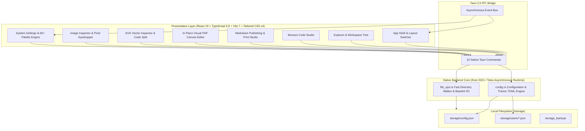
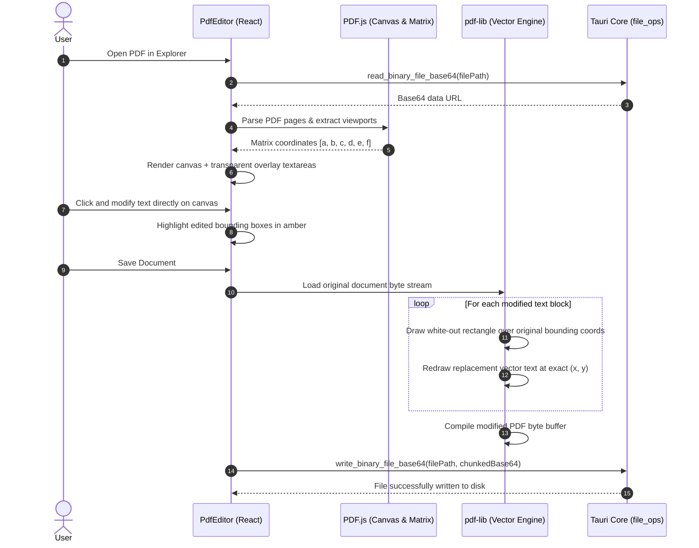

<div align="center">


# Composer

**The Offline-First, Local-Native Desktop Creator Studio & Developer Workbench**

[](https://tauri.app/)
[](https://www.rust-lang.org/)
[](https://react.dev/)
[](https://www.typescriptlang.org/)
[](https://vitejs.dev/)
[](https://tailwindcss.com/)
[](https://microsoft.github.io/monaco-editor/)
[](https://github.com/)
[](LICENSE)

<p align="center">
  <a href="#-overview">Overview</a> •
  <a href="#-key-features">Key Features</a> •
  <a href="#-system-architecture">Architecture</a> •
  <a href="#-modules-in-depth">Modules</a> •
  <a href="#-getting-started">Getting Started</a> •
  <a href="#-configuration--schemas">Configuration</a> •
  <a href="#-shortcuts">Shortcuts</a> •
  <a href="#-repository-structure">Structure</a> •
  <a href="#-roadmap">Roadmap</a>
</p>

</div>

---

## 🌟 Overview

**Composer** is a privacy-first, ultra-lightweight desktop creator studio designed for developers, technical writers, and researchers who demand uncompromising speed, distraction-free ergonomics, and complete data ownership.

Built on **Tauri 2.0**, **Rust**, and **React 19**, Composer eliminates web-wrapper resource bloat and recurring cloud subscriptions. It consolidates code editing, long-form Markdown publishing with a native print/PDF exporter, in-place visual PDF text replacement, vector SVG graphics analysis, and pixel-level image inspection into a unified workspace—**with zero telemetry, zero idle background daemons, and 100% offline isolation.**

---

## ✨ Key Features

```
┌────────────────────────────────────────────────────────────────────────────────────────┐
│                                   COMPOSER CORE                                        │
├─────────────────────────┬───────────────────────────┬──────────────────────────────────┤
│ 🛡️ 100% Offline & Local │ ⚡ Instant Startup        │ 📄 In-Place PDF Canvas Editor    │
│ Zero telemetry or cloud │ Launches in < 350ms with  │ User-space vector-accurate text  │
│ dependency. All files   │ under 80 MB idle RAM;     │ replacement with zero layout     │
│ stay on your device.    │ no heavy C++ dependencies.│ distortion using pdf-lib.        │
├─────────────────────────┼───────────────────────────┼──────────────────────────────────┤
│ 💻 Monaco Code Studio   │ 📝 Markdown Print Studio  │ 🔍 SVG & Pixel Image Studio      │
│ Multi-tab code editor,  │ Split preview, drop caps, │ Pan, zoom, nearest-neighbor      │
│ 15+ language highlighters,│ GFM alerts, TOC, and    │ pixelation, SVG element analysis,│
│ Vim mode & auto-save.   │ custom A4/Letter print PDF│ and canvas pixel eyedropper.     │
├─────────────────────────┼───────────────────────────┼──────────────────────────────────┤
│ 🔒 Zero Bloat & Daemon  │ 📁 Fast Workspace Walker  │ 🎨 Editorial Design System       │
│ Pure local execution    │ Smart recursive indexer,  │ 60+ curated palettes, 3D dice    │
│ without background cron │ folder switcher, snapshots│ randomizer, 8 font presets, and  │
│ daemons or CPU polling. │ and file/folder CRUD.     │ 6 dynamic navigation layouts.    │
└─────────────────────────┴───────────────────────────┴──────────────────────────────────┘
```

---

## 🏗️ System Architecture

Composer pairs a native asynchronous Rust backend with a modern React 19 / TypeScript presentation layer, communicating through Tauri 2.0's zero-copy IPC bridge.



---

## 📦 Modules in Depth

### 1. 📁 Explorer & Monaco Workspace Studio
* **VS Code-Grade Editing:** Integrated Monaco Editor with syntax highlighting for 15+ languages (Rust, TypeScript, JavaScript, Python, HTML, Markdown, CSS, JSON, TOML, SQL, etc.), Vim mode toggle, and custom typography.
* **Dynamic Theme Integration:** Automatically synchronizes Monaco's theme (`vs-dark` vs. `vs-light`) with the active editorial palette luminance (`--theme-ink`).
* **Fast File Walker:** Recursive directory indexing with automatic exclusion of build artifacts (`node_modules`, `target`, `.git`, `dist`, `build`) and depth-limiting for maximum performance.
* **Multi-Tab Document Workspace:** Open multiple files simultaneously with dirty-state change tracking (`•`), version history snapshot rollback, and native OS file/folder picker imports.

---

### 2. 📄 In-Place Visual PDF Canvas & Vector Editor
Composer enables direct, non-destructive text editing inside existing PDF documents without layout distortion or expensive cloud PDF tooling:



* **Zero Layout Shift:** Maps transparent interactive textareas directly over PDF text using user-space coordinate transforms.
* **Stack-Safe Chunked Base64:** Converts large binary documents into 8KB chunks during serialization to prevent browser call-stack overflow.
* **Native Dialogs:** Supports in-place overwrite or export via `save_file_dialog`.

---

### 3. 📝 Markdown Publishing & Print Studio
* **Three-Way View Switcher:** Seamlessly switch between **Preview Mode** (dedicated reader), **Split Mode** (Monaco + live preview), and **Code Mode** (pure editor).
* **Editorial Elements:** Drop cap opening styling, formatted tables, task checklists, syntax-highlighted code fences with one-click copy, and custom GitHub-style alerts (`[!NOTE]`, `[!TIP]`, `[!IMPORTANT]`, `[!WARNING]`, `[!CAUTION]`).
* **Interactive Table of Contents:** Automatically extracts `h1`–`h6` headings into an interactive slide-out navigation drawer with smooth scrolling.
* **Print & PDF Export Studio:** Dedicated print modal allowing full customization before printing or saving to PDF:
  * Page Sizes: `A4`, `Letter`, `Legal`
  * Orientations: `Portrait`, `Landscape`
  * Margins: `Normal` (20mm), `Narrow` (10mm), `Wide` (30mm)
  * Print Themes: `White`, `Editorial` cream, or `Monochrome`
  * Header/Footer toggles, page numbers, embedded TOC page, and drop cap controls.
* **Local Asset Resolution:** Automatically resolves relative image paths (``) against the workspace root via Tauri’s asset protocol.

---

### 4. 🔍 Interactive SVG Vector Inspector
* **Live Vector Canvas:** Vector graphics rendering with smooth wheel zoom and drag-to-pan controls.
* **Three-Way View Modes:** Toggle between full visual preview, split-view (Monaco XML editor + live SVG canvas), or raw code view.
* **Real-Time XML Validation:** Non-blocking error indicator displays parser issues while preserving the last valid render on canvas without crashing.
* **Backdrop Presets:** Test transparency and contrast against `Grid`, `Checkerboard`, `Paper`, `Dark`, and `Light` backgrounds.
* **Element Metrics:** Inspect total DOM node count, `<path>` count, `viewBox` attributes, dimensions, and file size.
* **Quick Export:** One-click copy raw SVG markup to clipboard or download to local disk.

---

### 5. 🖼️ Advanced Image Inspector Suite
* **Full Viewport Navigation:** Smooth zoom (25% to 400% & Auto-Fit presets), drag-to-pan, 90° rotation, and horizontal/vertical flipping.
* **Nearest-Neighbor Pixelated Mode:** Switch between smooth bicubic interpolation and nearest-neighbor scaling for inspecting pixel art, icons, textures, and sprites at high magnification.
* **Canvas Pixel Eyedropper:** Real-time color picker sampling pixel RGBA values under the cursor from an offscreen HTML5 canvas buffer; displays live HEX and RGB values with one-click clipboard copying.
* **Metadata Inspector:** Displays natural dimensions, calculated aspect ratio, total megapixels, file format, byte size, and full filepath with a one-click "reveal in file manager" button.

---

### 6. 🎨 Editorial Design System & Multi-Layout Engine
* **Dynamic CSS Custom Properties:** Real-time styling tokens injected directly into `document.documentElement.style` (`--theme-paper`, `--theme-ink`, `--theme-cream`, `--theme-rule`, `--theme-accent`, etc.).
* **60+ Curated Palettes:** Rich collection of dark and light themes (Nord Slate, Crimson Night, Cyber Phosphor, Editorial Linen, Sandstone, Obsidian, Synthwave, Catppuccin, etc.).
* **3D Rolling Dice Randomizer:** Rolling 3D dice button with 360-degree animation for instant palette discovery.
* **Typewriter-Animated Color Inputs:** Visual character typing animation for HEX color codes.
* **Atmospheric Accent Glow:** Toggleable neon atmospheric glow with brightness slider (20% to 250%).
* **Edge Smoothness Controls:** Fine-tuned sliders for general UI border radius (0px to 24px) and Navbar smoothness.
* **8 Typography Profiles:** Neo-Classical (EB Garamond + Playfair Display), Crisp Sans (Inter), Cyber Mono (JetBrains Mono), Warm Retro (Georgia + Courier New), Geometric Sans (Outfit), Space Monospace, Fira Code, and Data Geometric (Lexend).
* **6 Dynamic Navigation Layouts:**
  1. **Left Fixed Sidebar (Default):** Brand header, typewriter welcome banner, navigation items, and live CPU RAM hardware meter.
  2. **Right Fixed Sidebar:** Mirrored right-hand navigation for multi-monitor setups.
  3. **Left Vertical Pills:** Ultra-compact 64px icon rail maximizing editor space.
  4. **Right Vertical Pills:** Mirrored compact icon rail.
  5. **Top Horizontal Navbar:** 48px header with navigation pills and system indicators.
  6. **Bottom Horizontal Navbar:** 48px footer bar.
* **Theme Import / Export:** Export custom palettes to external `.toml` files or import community presets.

---

## 🚀 Getting Started

### Prerequisites

* **Node.js:** `v20.x` or `v22.x` (with `npm` or `pnpm`)
* **Rust Toolchain:** Stable `rustc` & `cargo` (1.78+)
* **Platform Dependencies:**
  * **Windows:** Visual Studio 2022 with Desktop development with C++ workload
  * **macOS:** Xcode Command Line Tools (`xcode-select --install`)
  * **Linux:** Standard webkit dependencies:
    ```bash
    sudo apt update && sudo apt install -y libwebkit2gtk-4.1-dev build-essential curl wget file libssl-dev libayatana-appindicator3-dev librsvg2-dev
    ```

---

### Installation & Development

1. **Clone the repository:**
   ```bash
   git clone https://github.com/your-username/composer.git
   cd composer
   ```

2. **Install frontend dependencies:**
   ```bash
   npm install
   ```

3. **Run in development mode (Vite + Tauri):**
   ```bash
   npm run tauri dev
   ```

4. **Build production standalone executable:**
   ```bash
   npm run tauri build
   ```
   The compiled executable will be generated in `src-tauri/target/release/bundle/`.

---

## ⚙️ Configuration & Schemas

### Application Configuration (`storage/config.json`)

```json
{
  "general": {
    "app_name": "Composer",
    "language": "en",
    "date_format": "YYYY-MM-DD",
    "launch_page": "Explorer",
    "auto_update": false
  },
  "storage": {
    "root_path": "C:\\Users\\User\\Composer\\storage",
    "workspace_path": "C:\\Users\\User\\Projects"
  },
  "editor": {
    "font_family": "EB Garamond",
    "font_size": 17,
    "line_height": 1.6,
    "tab_size": 4,
    "auto_save_interval_sec": 10,
    "vim_mode": false,
    "max_versions_per_file": 20,
    "total_version_storage_limit_mb": 100
  },
  "theme": {
    "theme_preset": "light",
    "accent_color": "#b8440c",
    "nav_layout": "sidebar",
    "nav_sidebar_width": 224,
    "ui_overrides": {
      "nav_background": "#f6f2ea",
      "text_color": "#18140f",
      "card_background": "#ede8dc",
      "card_border": "#c9bfab",
      "border_accent": "#b8440c",
      "ui_edge_smoothness": "4px",
      "navbar_edge_smoothness": "0px"
    }
  }
}
```


---

## ⌨️ Global Shortcuts & Keybindings

| Shortcut | Context | Action |
| :--- | :--- | :--- |
| <kbd>Ctrl</kbd> + <kbd>S</kbd> / <kbd>Cmd</kbd> + <kbd>S</kbd> | Monaco Editor | Save active document buffer to disk |
| <kbd>Ctrl</kbd> + <kbd>F</kbd> / <kbd>Cmd</kbd> + <kbd>F</kbd> | Explorer | Focus workspace file search input |
| <kbd>F5</kbd> / <kbd>Ctrl</kbd> + <kbd>R</kbd> | Global | Reload application webview window |
| <kbd>F11</kbd> | Global | Toggle borderless fullscreen mode |
| <kbd>Mouse 4</kbd> / <kbd>Mouse 5</kbd> | Navigation | Step backward / forward across navigation views |
| <kbd>Right-Click</kbd> | Files / Cards | Open contextual action menu (Rename, Delete, Reveal, Run) |
| <kbd>Escape</kbd> | Overlays | Dismiss active dialogs, settings drawers, or modals |

---

## 📂 Repository Structure

```
Composer/
├── 📁 public/                 # Static web assets and icons
├── 📁 src/                    # Frontend presentation layer (React 19 + TypeScript 5.8)
│   ├── 📁 assets/             # Brand logos, fonts, and styling assets
│   ├── 📁 components/         # Core application views and modules
│   │   ├── 📄 ContextMenu.tsx     # Universal custom context action menu
│   │   ├── 📄 Explorer.tsx        # Multi-tab workspace, file tree & tab router
│   │   ├── 📄 ImagePreview.tsx    # Raster image inspector & canvas eyedropper
│   │   ├── 📄 MarkdownPreview.tsx # Markdown publishing & print studio
│   │   ├── 📄 PdfEditor.tsx       # In-place visual PDF text replacement canvas
│   │   ├── 📄 Settings.tsx        # 60+ palette engine, typography & layout settings
│   │   └── 📄 SvgPreview.tsx      # SVG vector code & preview inspector
│   ├── 📄 App.tsx             # Root desktop shell & 6-layout navigation router
│   ├── 📄 index.css           # Tailwind CSS v4 design tokens & CSS variables
│   ├── 📄 main.tsx            # React application bootstrap entrypoint
│   └── 📄 types.ts            # TypeScript data models and IPC definitions
├── 📁 src-tauri/              # Native backend core (Rust 2021 + Tauri 2.0)
│   ├── 📁 capabilities/       # Tauri security policies & permission sets
│   ├── 📁 icons/              # Multi-resolution application icons
│   ├── 📁 src/                # Rust backend modules
│   │   ├── 📄 config.rs       # App configuration loader, watcher & theme TOML I/O
│   │   ├── 📄 file_ops.rs     # Directory tree walker & base64 binary streaming
│   │   ├── 📄 lib.rs          # Tauri command dispatcher (22 commands) & lifecycle
│   │   └── 📄 main.rs         # Native binary desktop entrypoint
│   ├── 📄 Cargo.toml          # Rust dependencies & compiler optimization flags
│   └── 📄 tauri.conf.json     # Tauri 2.0 window configuration & security settings
├── 📄 PRD.md                  # Comprehensive Product Requirements Document (PRD v2.0.0)
├── 📄 package.json            # Node.js dependencies & scripts manifest
├── 📄 tsconfig.json           # TypeScript compilation configuration
└── 📄 vite.config.ts          # Vite bundler configuration & worker aliases
```

---

## 🗺️ Roadmap

- [x] **Phase 1: Native Desktop Creator Studio**
  - [x] Tauri 2.0 shell with high-performance Rust core (<350ms launch, <80MB RAM)
  - [x] VS Code-grade Monaco workspace with 15+ language highlighters
  - [x] In-place direct vector text replacement for PDFs (`pdf-lib` + `pdfjs-dist`)
  - [x] Markdown publishing studio with A4/Letter/Legal print & PDF export engine
  - [x] Interactive SVG inspector and raster image studio with pixel eyedropper
  - [x] Editorial typography design system with 60+ palettes and 6 navigation layouts
- [ ] **Phase 2: Enhanced Developer Tools**
  - [ ] Local Git status indicators in Explorer and side-by-side Monaco diff viewer
  - [ ] Multi-pane horizontal and vertical editor splitting
- [ ] **Phase 3: Advanced Ecosystem**
  - [ ] Encrypted local workspace backup archives
  - [ ] Peer-to-peer local network workspace synchronization

---

## 📄 License

This project is licensed under the [MIT License](LICENSE) — feel free to use, modify, and distribute it in accordance with the license terms.

<div align="center">

**Built with precision for creators and developers who value local-first privacy, speed, and bespoke aesthetics.**

<sub>Made with ❤️ using Tauri 2.0, Rust, React 19, Vite, and Tailwind CSS v4</sub>

</div>
